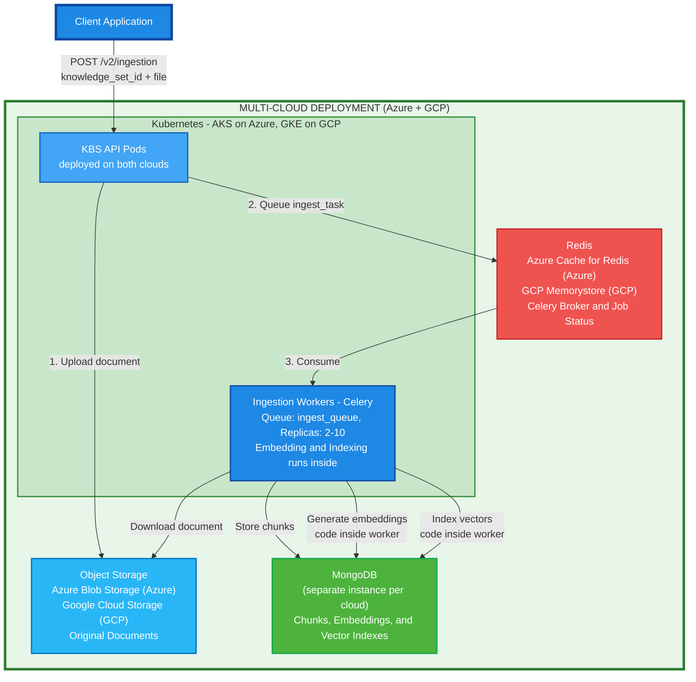
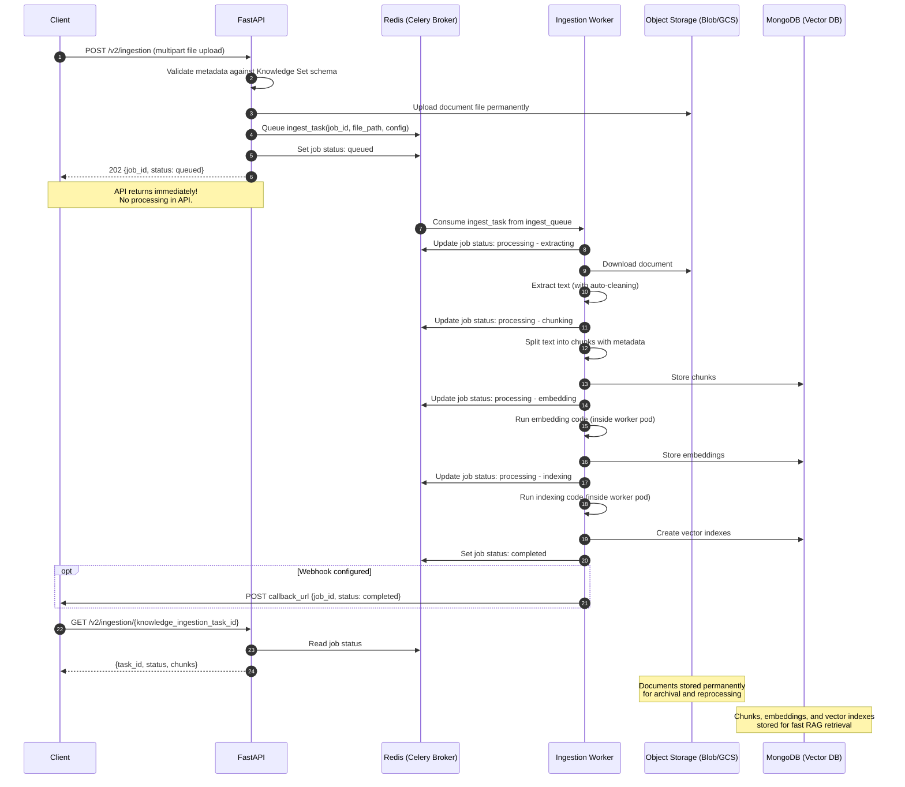

# RAG Ingestion API - Design Document

## Table of Contents
1. [Introduction](#executive-summary)
2. [System Architecture](#system-architecture)
3. [API Design](#api-design)
4. [Pipeline Components](#pipeline-components)
5. [Technology Stack](#technology-stack)
6. [Multi-Cloud Configuration](#multi-cloud-configuration)
7. [Infrastructure & Deployment](#infrastructure--deployment)
8. [Implementation Patterns](#implementation-patterns)
9. [Monitoring & Observability](#monitoring--observability)
10. [Summary](#Summary)

---

## Introduction

The RAG Ingestion API is a scalable, multi-cloud document processing pipeline that extracts and chunks documents for retrieval-augmented generation (RAG) systems. The system is deployed across **Azure (AKS)** and **GCP (GKE)** with consistent architecture and configuration.

### Current vs New API Comparison

| Aspect | Current                                                          | New Design                                                                                                             |
|--------|------------------------------------------------------------------|------------------------------------------------------------------------------------------------------------------------|
| **Processing Model** | In-process background tasks (Starlette BackgroundTasks)          | Distributed task queue (Celery) with unified atomic pipeline                                                           |
| **Scalability** | Limited - cannot scale ingestion independently                   | Auto-scale workers (2-10) based on queue depth and CPU utilization                                                     |
| **Fault Tolerance** | Task failure = job loss, no retry                                | Application-defined retry logic for transient errors (network, storage), permanent errors (bad files) fail immediately |
| **Task Recovery** | Pod crash = complete job loss, user needs re-upload the document | Document persists in storage, task can be retried by another Celery worker                                             |
| **Resource Isolation** | API pods handle both search and ingestion                        | Dedicated Celery worker pods separate from API pods                                                                    |
| **Monitoring** | Basic metrics only, no task/queue visibility                     | Task-level metrics via Celery Flower, queue depth, worker status                                                       |
| **Document Storage** | Local pod storage, deleted after processing                      | Permanent storage in Object Storage (Blob/GCS) for archival and reprocessing                                           |

### Limitations of Current API

1. **No Fault Recovery**: If a pod crashes mid-processing, the entire job is lost
2. **Resource Contention**: Heavy ingestion jobs can impact API responsiveness for all endpoints
3. **Inefficient Scaling**: Must scale entire API pod even if only ingestion is heavy
4. **Memory Constraints**: Large documents can exhaust pod memory
5. **Limited Observability**: No visibility into which pipeline stage is slow
6. **Single Point of Failure**: One stage failure kills the entire job
7. **No Permanent Document Storage**: Files stored locally in pod storage and deleted after processing
   - Cannot reprocess documents without re-uploading
   - No archival for compliance or audit requirements
   - Lost if processing fails before completion

### Advantages of New API

1. **Simple Scaling**: Scale unified workers from 2 to 10 pods based on queue depth
2. **Fault Tolerance**: Celery automatic retries with exponential backoff
3. **Resource Isolation**: Ingestion processing offloaded to dedicated Celery worker pods
4. **Task Replay**: Reprocess failed tasks from any pipeline stage
5. **Cost Optimization**: Scale down idle workers, use spot instances
6. **Better Observability**: Monitor task queues via Celery Flower
7. **Multi-Cloud Ready**: Deploy identical pipelines in Azure and GCP
8. **API Responsiveness**: FastAPI pods only dispatch tasks, heavy processing in workers
9. **Permanent Document Storage**: Original files stored permanently in Object Storage (Azure Blob/GCS)
   - Reprocess documents anytime without re-uploading
   - Archival for compliance, audit, and legal requirements
   - Documents survive pod crashes and can be reprocessed with different configurations

**Key Design Principles:**
- Multi-cloud architecture (Azure + GCP with unified configuration)
- Cloud-agnostic components with cloud provider specific adapters
- Interface-driven design with factory pattern for cloud abstraction
- Asynchronous processing via Celery task queues
- Dedicated Celery worker pods for heavy processing (separate from API pods)
- Horizontal scalability for Celery worker pods with Kubernetes (AKS/GKE)

---

## System Architecture

### Multi-Cloud Architecture Overview



**Complete multi-cloud deployment architecture** showing:
- **Client Layer**: Applications submit jobs via REST API with `knowledge_set_id` (references existing Knowledge Set entity)
- **API Layer**: FastAPI pods (1-2 replicas) deployed identically on both Azure and GCP
  - **API Responsibility**: ONLY validates metadata, uploads document to Object Storage, queues task, returns 202 immediately
  - **No Processing in API**: All heavy processing happens asynchronously in workers
- **Task Queue**: Redis-backed Celery with single queue
  - `ingest_queue` - Single queue for all ingestion tasks
  - **Azure**: Azure Cache for Redis
  - **GCP**: GCP Memorystore (Redis)
- **Worker Pool**: Unified ingestion workers (2-10 pods) that handle complete pipeline
  - Extract text and chunk documents
  - Store chunks to MongoDB
  - **Run embedding code inside worker pods** to generate embeddings
  - **Run indexing code inside worker pods** to index vectors
  - All processing happens within the Celery worker pods in Kubernetes
- **Storage**:
  - **Object Storage**: Azure Blob Storage (Azure) / Google Cloud Storage (GCP) - original documents stored permanently
  - **MongoDB**: Separate MongoDB instance within each cloud for chunks, embeddings, and vector indexes (MongoDB serves as vector database)
- **Processing Flow** (Fully Asynchronous):
  1. API receives file upload with `knowledge_set_id` and validates metadata against Knowledge Set schema
  2. API uploads document to Object Storage and queues `ingest_task` to `ingest_queue`
  3. **API returns 202 immediately** - no processing in API
  4. Ingestion worker extracts+cleans text, chunks it, stores chunks to MongoDB
  5. Worker runs embedding code (inside worker pod) to generate and store embeddings to MongoDB
  6. Worker runs indexing code (inside worker pod) to create vector indexes in MongoDB
  7. Worker updates job status to completed
- **Multi-Cloud**: Identical architecture deployed on Azure (AKS + Redis + Blob + MongoDB) and GCP (GKE + Memorystore + GCS + MongoDB)

**Key Design Decisions:**
- **API Only Dispatches**: FastAPI endpoint only validates, uploads, and queues - returns 202 in <100ms
- **Fully Async Processing**: All extraction, chunking, embedding, and indexing happens in workers
- **Single Worker Pool**: Unified workers handle complete pipeline (extract → chunk → embed → index)
- **Embedding/Indexing Inside Workers**: All code runs inside Celery worker pods in Kubernetes (no external services)
- **Single Queue**: `ingest_queue` for all ingestion tasks (simplified architecture)
- **MongoDB as Vector DB**: MongoDB serves as both document store and vector database (no separate vector DB)
- **Documents in Object Storage**: 10x cheaper than MongoDB, built for large files, permanent archival
- **Chunks and Vectors in MongoDB**: Rich querying, metadata filtering, vector indexes for fast RAG retrieval
- **No local storage**: Enhanced v1 now stores files permanently in cloud Object Storage (previously local storage)
- **Document cleaning**: Automatically performed by Unstructured library during extraction

### Component Interaction - Sequence Diagram



End-to-end flow of a document ingestion request showing interactions between client, FastAPI, unified Celery worker, cloud storage (Blob/GCS), MongoDB (vector database), and Redis. Demonstrates metadata validation, job creation, file upload, **fully asynchronous processing** (extract → chunk → embed → index), status updates, and optional webhook callbacks.

**Note:**
- **API Returns Immediately**: The API only validates metadata, uploads document to Object Storage, queues the task, and returns 202. No processing happens in the API layer.
- **Metadata Validation**: The API validates `config.embedding.metadata` against the schema defined at the Knowledge Set level **before** uploading the file or dispatching the task. If validation fails, the request is rejected with a 400 or 422 error.
- **Single Task, Complete Pipeline**: One Celery task handles the complete pipeline:
  1. Extract and chunk document
  2. Store chunks to MongoDB
  3. Run embedding code (inside worker pod) to generate and store embeddings to MongoDB
  4. Run indexing code (inside worker pod) to create vector indexes in MongoDB
  5. Mark job as completed
- **Code Inside Workers**: All embedding and indexing code runs inside Celery worker pods in Kubernetes (no external services)
- **MongoDB as Vector DB**: MongoDB serves as both document store and vector database

---

### Component Architecture

**Layer 1: API Layer**
- FastAPI REST endpoints for ingestion and status
- **Responsibility**: Validate metadata, upload to Object Storage, queue first task, return 202
- **No Processing**: All heavy processing delegated to workers
- Celery task dispatcher for async job submission

**Layer 2: Task Queue (Celery + Redis)**
- Single queue: `ingest_queue` for all ingestion tasks
- Complete pipeline processing in single task (extract → chunk → embed → index)
- Automatic retries with exponential backoff

**Layer 3: Worker Pool (Kubernetes - AKS/GKE)**
- **Unified Ingestion Workers** (2-10 replicas): Handle complete pipeline
  - Extract text and chunk documents
  - Store chunks to MongoDB
  - Run embedding code inside worker pods to generate embeddings
  - Run indexing code inside worker pods to create vector indexes
  - All processing happens within worker pods (no external service calls)
- Auto-scaling based on queue depth + CPU utilization
- Identical deployments across AKS and GKE

**Layer 4: Storage (Cloud-specific with unified interface)**
- Object Storage: Azure Blob Storage (AKS) / Google Cloud Storage (GKE)
- Task Broker/Backend: Azure Cache for Redis (AKS) / GCP Memorystore Redis (GKE)
- Job State: Redis for task status and progress tracking
- MongoDB (Vector Database): Separate instance within each cloud for chunks, embeddings, and vector indexes

---

## API Design

### RESTful Endpoints

#### 1. Submit Ingestion Job

**POST** `/v2/ingestion`

**API Behavior:**
- ✅ Validates `knowledge_set_id` exists
- ✅ Validates `config.embedding.metadata` against Knowledge Set schema
- ✅ Uploads document to Object Storage (Azure Blob / GCS)
- ✅ Queues `ingest_task` to `ingest_queue`
- ✅ Returns **202 Accepted** immediately (typically <100ms)
- ❌ **NO processing happens in API** - all extraction, chunking, embedding, and indexing happen asynchronously in separate worker pools

**Content-Type:** `multipart/form-data`

**Request Parameters:**

| Parameter | Type | Required | Description |
|-----------|------|----------|-------------|
| `file` | File (UploadFile) | **Yes** | Document file to process (PDF, DOCX, HTML, etc.) |
| `knowledge_set_id` | String (UUID) | **Yes** | ID of the existing Knowledge Set to which this document belongs |
| `config` | JSON string | No | Processing configuration (chunking, embedding with metadata) |
| `callback_url` | String (URL) | No | Webhook URL for job completion notification |

**Request Example (cURL):**

```bash
# Basic upload with default config
curl -X POST "https://api.example.com/v2/ingestion" \
  -F "file=@document.pdf" \
  -F "knowledge_set_id=550e8400-e29b-41d4-a716-446655440000"

# Upload with custom configuration
curl -X POST "https://api.example.com/v2/ingestion" \
  -F "file=@document.pdf" \
  -F "knowledge_set_id=550e8400-e29b-41d4-a716-446655440000" \
  -F 'config={"chunking":{"strategy":"recursive","chunk_size":512,"chunk_overlap":50},"embedding":{"metadata":{"title":"Q4 Financial Report","author":"John Doe","department":"Finance"}}}' \
  -F "callback_url=https://example.com/webhook/job-completed"
```

**Important Notes:**
- The `-F` flag tells curl to send `multipart/form-data` (not JSON)
- The `@` symbol before filename (`file=@document.pdf`) tells curl to read and upload the **binary file contents**
- The `knowledge_set_id` must reference an existing Knowledge Set (managed via separate CRUD APIs)
- **Metadata validation**: The `metadata` inside `config.embedding` must conform to the schema defined at the Knowledge Set level. The API validates this schema **before** starting file ingestion.
- The `config` field is a **JSON string** (not JSON object) within the multipart form
- Without `@`, curl sends the literal string; with `@`, curl sends the actual file bytes

**Python Example:**
```python
import requests
import json

url = "https://api.example.com/v2/ingestion"

with open("document.pdf", "rb") as f:
    files = {'file': ('document.pdf', f, 'application/pdf')}

    data = {
        'knowledge_set_id': '550e8400-e29b-41d4-a716-446655440000',
        'config': json.dumps({
            "chunking": {"strategy": "recursive", "chunk_size": 512, "chunk_overlap": 50},
            "embedding": {
                "metadata": {
                    "title": "Q4 Financial Report",
                    "author": "John Doe",
                    "department": "Finance"
                }
            }
        }),
        'callback_url': 'https://example.com/webhook/job-completed'
    }

    response = requests.post(url, files=files, data=data)
    print(response.json())
```

**Default Configuration** (when `config` not provided):
```json
{
  "extraction": {
    "library": "unstructured"
  },
  "chunking": {
    "strategy": "recursive",
    "chunk_size": 512,
    "chunk_overlap": 50
  },
  "embedding": {
    "metadata": {}
  }
}
```

**Note:**
- **Extraction**: Uses Unstructured library (only supported option) which automatically handles text extraction and cleaning - no additional configuration needed
- **Metadata**: Must be provided inside `config.embedding.metadata` and conform to the schema defined at the Knowledge Set level. Validated before ingestion starts.

**Success Response (202 Accepted):**
```json
{
  "task_id": "knowledge_ingestion_task_id",
  "status": "queued",
  "submitted_at": "2025-10-05T10:30:00Z",
  "filename": "document.pdf",
  "knowledge_set_id": "550e8400-e29b-41d4-a716-446655440000"
}
```

**Error Responses:**

**422 Unprocessable Entity** - Request validation failed (FastAPI/Pydantic validation errors):
```json
{
  "detail": [
    {
      "loc": ["string", 0],
      "msg": "string",
      "type": "string"
    }
  ]
}
```

**400 Bad Request** - Invalid configuration, missing required fields, unsupported file format, or **metadata schema validation failure**:
```json
{
  "error": "Metadata validation failed",
  "details": "Field 'author' is required but not provided. Field 'priority' must be one of: low, medium, high"
}
```

**404 Not Found** - Knowledge Set ID does not exist

**413 Payload Too Large** - File exceeds maximum size limit (100MB)

**500 Internal Server Error** - Object Storage failure, queue failure

#### 2. Get Job Status

**GET** `/v2/ingestion/{knowledge_ingestion_task_id}`

**Response:**
```json
{
  "task_id": "task_abc123",
  "status": "processing",
  "chunks": [
    "chunk1",
    "chunk2"
  ]
```

---

## Pipeline Components

The pipeline uses **interface-driven design** with pluggable extraction libraries and chunking strategies. Each component has defaults that can be overridden via API configuration.

**Note:**
- Document cleaning/normalization is automatically performed by the extraction library (Unstructured) and does not require separate configuration.
- Chunking uses a single strategy selection (not multiple strategies).

### 1. Extract Component

**Purpose:** Extract and clean text from documents (extraction includes automatic cleaning/normalization)

**Interface:**
```python
from abc import ABC, abstractmethod
from pydantic import BaseModel, Field
from typing import Dict, Any, List, Optional

class ExtractionResult(BaseModel):
    text: str  # Already cleaned and normalized by extractor
    metadata: Dict[str, Any]
    warnings: Optional[List[str]] = Field(default_factory=list)

    class Config:
        extra = "forbid"  # Prevent unexpected fields

class IExtractor(ABC):
    @abstractmethod
    def extract(self, source: Any, config: Dict) -> ExtractionResult:
        """Extract and clean text from source document"""
        pass

    @abstractmethod
    def supports_format(self, format: str) -> bool:
        """Check if this extractor supports the given format"""
        pass
```

**Supported Formats:**
- PDF, DOCX, DOC, PPTX, HTML, Markdown, TXT, and 20+ more formats

**Extraction Library:**
- **`unstructured`** (only supported option): Open-source multi-format document parser
  - Supports 20+ document formats (PDF, DOCX, HTML, TXT, Markdown, etc.)
  - Local processing, no external API calls
  - Handles text extraction, tables, and document structure
  - **Automatic cleaning and normalization** (see below)

#### Document Cleaning & Normalization (Built-in)

The Unstructured library automatically performs cleanup and normalization during extraction to make text usable for downstream NLP or RAG pipelines. **No separate cleaning step is required.**

| Cleaning Step | Description |
|---------------|-------------|
| **Whitespace normalization** | Removes redundant newlines, extra spaces, line breaks split across PDF lines |
| **Character cleanup** | Fixes encoding issues (like smart quotes, ligatures, page headers/footers) |
| **Layout flattening** | Rebuilds logical reading order (important for multi-column PDFs) |
| **Dehyphenation** | Fixes broken words split across lines (common in PDFs) |
| **Section merging** | Joins paragraphs or list items belonging to the same section |
| **HTML tag removal** | Strips unwanted tags, leaving text clean |
| **Metadata enrichment** | Adds metadata like filename, page number, coordinates, category, table markers, etc. |

**Note:** Since cleaning is automatic, the extracted text from `ExtractionResult` is already normalized and ready for chunking.

### 2. Chunk Component

**Purpose:** Split text into optimal-sized segments with pluggable chunking strategies

**Interface:**
```python
class Chunk(BaseModel):
    id: str
    text: str
    metadata: Dict[str, Any]
    position: int

    class Config:
        extra = "forbid"

class IChunker(ABC):
    @abstractmethod
    def chunk(self, text: str, config: Dict) -> List[Chunk]:
        """Split text into chunks"""
        pass
```

**Available Chunking Strategies** (select one via API):
- **`recursive`** (default): Character-based splitting with configurable size and overlap
- **`semantic`**: Context-aware chunking based on semantic boundaries
- **`sentence`**: Split by sentence boundaries
- **`paragraph`**: Split by paragraph boundaries

**Configuration Parameters:**
- `strategy`: Single strategy selection (string, not list)
- `chunk_size`: Tokens per chunk (default: 512)
- `chunk_overlap`: Overlapping tokens between chunks (default: 50)

**Default Strategy:** `"recursive"`

### API Configuration Models

**Purpose:** Pydantic models for API request validation and configuration

**Models:**
```python
class ExtractionConfig(BaseModel):
    library: str = Field(default="unstructured")

    class Config:
        extra = "forbid"

class ChunkingConfig(BaseModel):
    strategy: str = Field(default="recursive")
    chunk_size: int = Field(default=512, ge=1, le=8192)
    chunk_overlap: int = Field(default=50, ge=0)

    class Config:
        extra = "forbid"

class EmbeddingConfig(BaseModel):
    metadata: Dict[str, Any] = Field(default_factory=dict)

    class Config:
        extra = "forbid"

class IngestionConfig(BaseModel):
    extraction: ExtractionConfig = Field(default_factory=ExtractionConfig)
    chunking: ChunkingConfig = Field(default_factory=ChunkingConfig)
    embedding: EmbeddingConfig = Field(default_factory=EmbeddingConfig)
    callback_url: Optional[str] = Field(None, max_length=2048)

    class Config:
        extra = "forbid"

class JobResponse(BaseModel):
    job_id: str
    status: str
    submitted_at: str
    filename: str
    knowledge_set_id: str

class JobStatusResponse(BaseModel):
    job_id: str
    status: str
    progress: Dict[str, Any]
    stats: Dict[str, Any]
```

**Benefits:**
- **Automatic validation**: FastAPI validates requests before reaching business logic
- **API documentation**: Auto-generated OpenAPI/Swagger docs with field constraints
- **Type safety**: Runtime type checking prevents invalid data
- **Default values**: Sensible defaults for optional fields
- **Field constraints**: `ge=1, le=8192` ensures chunk_size is within valid range

---

## Technology Stack

### Architecture Components

| Layer | Technology | Purpose |
|-------|------------|---------|
| **API Layer** | REST API Framework | Request handling, job submission, status queries |
| **Data Validation** | Pydantic | Runtime validation, API schemas, configuration models |
| **Task Queue** | Distributed Task Queue | Asynchronous job processing, task chaining, automatic retries |
| **Message Broker** | In-Memory Data Store | Task queue broker and result backend |
| **Container Orchestration** | Kubernetes | Multi-cloud worker pod management and auto-scaling |
| **Object Storage** | Cloud Blob Storage | Document and chunk persistence |
| **Document Extraction** | Multi-format Document Parser | Text extraction from 20+ document formats |
| **Text Processing** | Text Splitting Library | Chunking strategies (recursive, semantic) |
| **Monitoring** | Metrics & Visualization | Task monitoring, system metrics, dashboards |

### Cloud Services

| Service Type | Azure | GCP |
|--------------|-------|-----|
| **Kubernetes** | Azure Kubernetes Service (AKS) | Google Kubernetes Engine (GKE) |
| **Redis** | Azure Cache for Redis | GCP Memorystore (Redis) |
| **Object Storage** | Azure Blob Storage | Google Cloud Storage (GCS) |
| **Database/Vector DB** | MongoDB | MongoDB |

**Note:** Each cloud environment has its own separate MongoDB instance for data isolation. MongoDB serves as both document store and vector database.

---

## Multi-Cloud Configuration

### Cloud Provider Configuration

**Azure Configuration:**
- Storage account credentials
- Azure Cache for Redis connection
- AKS cluster settings

**GCP Configuration:**
- Project ID and service credentials
- GCP Memorystore (Redis) connection
- GKE cluster settings

### Pipeline Configuration

**Extraction Configuration:**
- Supported file formats: PDF, DOCX, HTML, TXT, Markdown, and 20+ formats
- Extraction library: `unstructured` (only option) - no configuration needed
- **Automatic cleaning/normalization** included in extraction (no separate config needed)

**Chunking Configuration:**
- Chunking strategy (single selection): `recursive`, `semantic`, `sentence`, `paragraph`
- Chunk size (tokens)
- Chunk overlap (tokens)
- Default: `strategy: "recursive"`

### Configuration Profiles

**Balanced Profile:**
- Chunking strategy: `recursive`, chunk_size: 512, overlap: 50
- Optimal for general digital documents

**High Quality Profile:**
- Chunking strategy: `semantic`, chunk_size: 256, overlap: 50
- Semantic chunking for precision

**Large Context Profile:**
- Chunking strategy: `recursive`, chunk_size: 2048, overlap: 100
- Larger chunks for long-form content

---

## Infrastructure & Deployment

### Multi-Cloud Kubernetes Architecture

**Deployment Strategy:** Identical configurations across AKS (Azure) and GKE (GCP)

**Namespace:** `rag-ingestion` (consistent across both clouds)

**Kubernetes Clusters:**
- **AKS (Azure):** Primary deployment in Azure region
- **GKE (GCP):** Mirror deployment in GCP region
- **Configuration:** Unified Helm charts with cloud-specific values

### Deployments

| Component | Replicas (Min-Max) | CPU | Memory | Auto-scale Metric |
|-----------|-------------------|-----|--------|-------------------|
| API | 3-10 | 500m | 512Mi | CPU > 70% |
| Ingestion Workers | 2-10 | 2000m | 4Gi | ingest_queue length + CPU |

**Note:**
- API pod deployment configuration remains unchanged. Only the API code is updated to queue tasks instead of using BackgroundTasks.
- Ingestion workers need more resources (2000m CPU, 4Gi memory) since they handle the complete pipeline including calling embedding and indexing services
- Workers scale based on ingest_queue depth

### Auto-scaling Strategy

**Scaling Metrics:**
- CPU utilization threshold
- Queue length monitoring
- Custom application metrics

**Scaling Behavior:**
- Automatic scale-up based on workload
- Gradual scale-down during idle periods
- Independent scaling of API pods and ingestion worker pods

### Task Queue Configuration

**Queue Setup:**
- Single queue for complete pipeline:
  - `ingest_queue` - All ingestion tasks (extract + chunk + embed + index)
- Unified worker pool handles complete pipeline
- No task chaining needed (single atomic task)

**Worker Configuration:**
- **Ingestion Workers**: Consume from `ingest_queue`, handle complete pipeline:
  - Extract text and chunk documents
  - Store chunks to MongoDB
  - Run embedding code (inside worker pod) to generate embeddings
  - Run indexing code (inside worker pod) to create vector indexes
  - All processing happens within the worker pod in Kubernetes
- Concurrency settings based on worker resources
- Task prefetch limits for optimal throughput
- Retry policies and backoff strategies for transient errors

### Worker Node Pools

**Node Pool Strategy:**
- Dedicated node pools for worker pods
- Separation from API pods for resource isolation
- Consistent configuration across clouds

**Cost Optimization:**
- Spot/preemptible instances for workers
- Automatic node scaling
- Resource limits per worker pod

**Benefits:**
- Independent scaling of processing and API layers
- Cost-efficient resource utilization
- Isolation prevents resource contention
- Consistent deployment across Azure and GCP

---

## Design Patterns

### Factory Pattern

**Purpose:** Create pipeline components based on configuration

**Components:**
- **Extractor Factory**: Creates Unstructured extractor (only supported option)
- **Chunker Factory**: Selects chunking implementation based on single strategy selection (recursive, semantic, sentence, paragraph)
- **Storage Factory**: Instantiates cloud-specific storage provider (Azure Blob / GCS)

**Benefits:**
- Decouples component creation from usage
- Supports multiple implementations per interface
- Easy to add new extraction libraries or chunking strategies
- Single strategy selection simplifies configuration and execution

### Cloud Provider Abstraction

**Storage Interface:**
- Upload and download operations
- Unified API across Azure Blob and GCS
- Cloud-specific implementations hidden behind interface

**Benefits:**
- Cloud-agnostic application code
- Easy to switch or add cloud providers
- Consistent behavior across deployments

### Dependency Injection

**Service Container:**
- Manages lifecycle of shared services
- Provides configured instances to workers
- Handles cloud-specific initialization

**Injected Services:**
- Task queue client
- Object storage provider
- Cache/state management
- Configuration

### Task Processing Pattern

**Base Task:**
- Common error handling
- Status updates
- Retry logic
- Logging

**Task Lifecycle (Single Unified Task):**

**Unified Ingestion Task (ingest_queue):**
1. Receive `ingest_task` from `ingest_queue`
2. Update status: "processing - extracting"
3. Download document from Object Storage
4. Extract text (with automatic cleaning by Unstructured)
5. Update status: "processing - chunking"
6. Chunk text with metadata
7. Store chunks to MongoDB
8. Update status: "processing - embedding"
9. Run embedding code (inside worker pod) to generate embeddings
10. Store embeddings to MongoDB
11. Update status: "processing - indexing"
12. Run indexing code (inside worker pod) to create vector indexes in MongoDB
13. Update job status to "completed"
14. Send webhook notification (if configured)

**Benefits:**
- Single atomic task eliminates inter-task coordination complexity
- Simpler deployment (one worker type instead of three)
- All code runs inside worker pods in Kubernetes (embedding and indexing)
- Still fully asynchronous (API returns 202 immediately)
- Easier to maintain and monitor

### Error Handling Strategy

**Retry Policy:**
- Automatic retries with exponential backoff
- Maximum retry attempts per task
- Dead letter queue for failed tasks

**Failure Recovery:**
- Task-level retries
- Job status tracking
- Manual replay capability

---

## Monitoring & Observability

### Monitoring Stack

**Celery Flower:**
- Web-based real-time monitoring tool for Celery workers and tasks
- Provides dashboard to view active workers, task queues, and execution status
- Allows manual task management (retry, revoke) through web UI
- Access via: `http://flower.example.com`

**Prometheus:**
- Time-series database for collecting and storing application metrics
- Scrapes metrics from `/metrics` endpoints exposed by the application
- Stores metrics with timestamps for historical analysis
- Powers alerting rules based on metric thresholds
- Query metrics using PromQL (Prometheus Query Language)

**Grafana:**
- Visualization and dashboarding tool for Prometheus metrics
- Creates custom dashboards with graphs, charts, and alerts
- Provides comprehensive view of pipeline health and performance

### Metrics (Prometheus)

**Celery Task Metrics:**
- `celery_tasks_total{task, state}` - Total tasks by state (SUCCESS, FAILURE, RETRY)
  - task: ingest_task (single unified task)
- `celery_task_duration_seconds{task}` - Task execution time
- `celery_queue_length{queue}` - Current queue depth
  - queue: ingest_queue (single queue)
- `celery_workers_active` - Active workers

**Pipeline Metrics:**
- `pipeline_documents_processed_total{stage}` - Documents processed per stage
  - stage: extraction, chunking, embedding, indexing
- `pipeline_processing_duration_seconds{stage}` - Stage processing time
  - stage: extraction, chunking, embedding, indexing
- `pipeline_errors_total{stage, error_type}` - Errors by stage and type
- `pipeline_jobs_total{status}` - Total jobs by status
  - status: queued, processing, completed, failed
- `pipeline_embeddings_generated_total` - Total embeddings generated
- `pipeline_vectors_indexed_total` - Total vectors indexed to vector database

**System Metrics:**
- `redis_memory_usage_bytes` - Redis memory consumption
- `storage_operations_total{operation, cloud}` - Cloud storage operations
- `mongodb_operations_total{operation}` - MongoDB operations (read, write, update, vector index, vector search)

### Dashboards (Grafana)

1. **Pipeline Health**: Success rate, error rate per stage, job completion rate
2. **Performance**: Task processing time, throughput per stage, queue depths
3. **Celery Metrics**: Worker utilization, task success/failure rates, retry counts
4. **Infrastructure**: Redis memory usage, worker pod CPU/memory, storage operations
5. **Cost Tracking**: Cloud storage usage, compute utilization, auto-scaling events

---

## Implementation Roadmap

### Phase 1: Core Pipeline (Weeks 1-4)

**Objective:** Build foundational two-stage pipeline

**Deliverables:**
- REST API for job submission and status tracking
- Extract and chunk pipeline stages
- Cloud storage integration
- Basic monitoring and logging

### Phase 2: Multi-Cloud Deployment (Weeks 5-7)

**Objective:** Deploy to Azure and GCP environments

**Deliverables:**
- Kubernetes cluster configuration (AKS/GKE)
- Worker pod deployments
- Auto-scaling configuration
- Multi-cloud validation and testing

### Phase 3: Monitoring & Observability (Weeks 8-9)

**Objective:** Implement comprehensive monitoring

**Deliverables:**
- Metrics collection and visualization
- Task queue monitoring
- Alerting and SLO definitions
- Performance dashboards

### Phase 4: Production Hardening (Weeks 10-12)

**Objective:** Optimize for production workloads

**Deliverables:**
- Performance optimization
- Reliability improvements (DLQ, retries)
- Documentation (API, deployment, operations)
- Disaster recovery procedures

### Future Enhancements

**Optional Capabilities:**
- Advanced OCR support for scanned documents
- Alternative extraction providers
- Embedding generation and vector indexing
- Advanced analytics and reporting

### Success Criteria

**Performance Targets:**
- Extraction latency (P95): < 2 seconds per document
- Chunking throughput: > 100 docs/minute per worker
- End-to-end pipeline: < 3 seconds for typical document

**Reliability Targets:**
- Pipeline success rate: > 99%
- Worker uptime: > 99.9%
- Data durability: 100% (via cloud storage)
- Automatic recovery: < 1 minute for worker failures

**Scalability Targets:**
- Support 1000+ concurrent ingestion jobs
- Handle documents up to 100MB
- Auto-scale from 10 to 100+ workers based on load
- Maintain latency targets under 10x normal load

---

## Summary

This design provides a **multi-cloud, scalable RAG ingestion pipeline** with:

### Architecture Highlights

- ✅ **Multi-Cloud Support**: Deployable on Azure (AKS) and GCP (GKE)
  - **Azure**: Azure Cache for Redis, Azure Blob Storage, MongoDB, AKS
  - **GCP**: GCP Memorystore (Redis), Google Cloud Storage, MongoDB, GKE
  - **Data Isolation**: Separate MongoDB instance within each cloud environment
- ✅ **Cloud Abstraction**: Unified interface across cloud providers
- ✅ **Distributed Processing**: Task queue-based asynchronous processing with single unified task
- ✅ **Unified Pipeline**: Single worker task handles complete pipeline (extract + chunk + embed + index)
- ✅ **Code Inside Workers**: All embedding and indexing code runs inside Celery worker pods in Kubernetes
- ✅ **Interface-Driven Design**: Pluggable extraction libraries and chunking strategies
- ✅ **Multiple Document Formats**: Support for 20+ file formats
- ✅ **Flexible Processing**: Configurable via API request (single strategy selection)
- ✅ **Auto-scaling**: Dynamic resource allocation based on workload
- ✅ **Cost Optimization**: Spot/preemptible instances for workers
- ✅ **Fault Tolerance**: Automatic retries and failure recovery
- ✅ **Observability**: Comprehensive metrics and monitoring

### Key Capabilities

**Document Processing:**
- **Extraction Library**: Unstructured (only supported option)
  - Multi-format support (PDF, DOCX, HTML, Markdown, and 20+ formats)
  - Local processing with no external API calls
  - **Automatic cleaning/normalization** built into extraction (whitespace, character cleanup, layout flattening, dehyphenation, etc.)
- **Chunking Strategy**: Single strategy selection - recursive, semantic, sentence, or paragraph (configurable via API)

**Infrastructure:**
- Kubernetes-based container orchestration
- Single unified worker pool with horizontal auto-scaling (2-10 replicas):
  - Ingestion Workers handle complete pipeline (extract + chunk + embed + index)
  - All embedding and indexing code runs inside worker pods
- Dedicated worker node pools for resource isolation
- Multi-cloud object storage
- MongoDB serves as both document store and vector database

**Operational Excellence:**
- REST API for job management (FastAPI + Pydantic)
- Automatic request validation with Pydantic models
- Auto-generated OpenAPI/Swagger documentation
- Real-time status tracking
- Webhook notifications
- Comprehensive monitoring and alerting

**Data Validation & Type Safety:**
- **Pydantic models** for all API requests and responses
- Runtime validation with field constraints (e.g., `chunk_size: >=1, <=8192`)
- Type-safe data structures throughout the pipeline
- Automatic JSON serialization/deserialization

The system is designed for production scale with consistent behavior across cloud providers.
