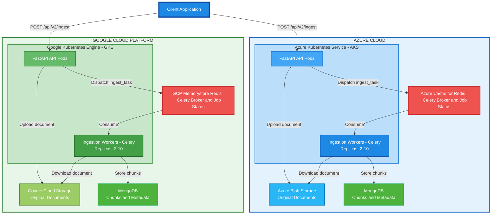
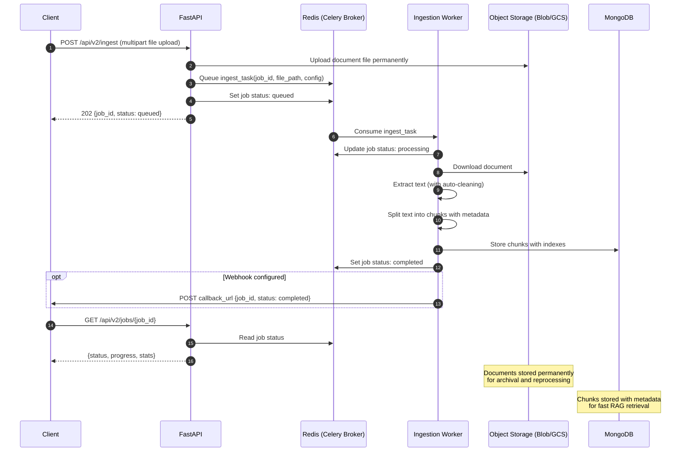

# RAG Ingestion API - Complete Design Document

## Table of Contents
1. [Introduction](#executive-summary)
2. [System Architecture](#system-architecture)
3. [API Design](#api-design)
4. [Pipeline Components](#pipeline-components)
5. [Technology Stack](#technology-stack)
6. [Multi-Cloud Configuration](#multi-cloud-configuration)
7. [Infrastructure & Deployment](#infrastructure--deployment)
8. [Implementation Patterns](#implementation-patterns)
9. [Monitoring & Observability](#monitoring--observability)
10. [Summary](#Summary)

---

## Introduction

The RAG Ingestion API is a scalable, multi-cloud document processing pipeline that extracts and chunks documents for retrieval-augmented generation (RAG) systems. The system is deployed across **Azure (AKS)** and **GCP (GKE)** with consistent architecture and configuration.

### Current vs New API Comparison

| Aspect | Current | New Design |
|--------|---------|------------|
| **Processing Model** | In-process background tasks (Starlette BackgroundTasks) | Distributed task queue (Celery-based) |
| **Scalability** | Limited - all stages run in single container | Independent - each stage scales separately via worker pools |
| **Fault Tolerance** | Task failure = job failure, no retry | Celery automatic retries + task failure handling |
| **Resource Utilization** | Monolithic - one pod handles all stages | Optimized - dedicated Celery worker pools per stage |
| **Long-running Jobs** | Pod restart = job loss | Jobs survive pod restarts (state in Redis/broker) |
| **Bottleneck Handling** | Cannot scale individual stages | Scale chunking workers independently from extractors |
| **Monitoring** | Limited visibility into pipeline stages | Stage-level metrics via Celery Flower dashboard |
| **Cost Efficiency** | Over-provisioned for peak load | Auto-scale based on queue length per stage |
| **Infrastructure Impact** | API pods handle both search and ingestion | Dedicated Celery worker pods for ingestion pipeline |
| **Concurrency** | Limited by pod CPU/memory | Celery worker pools enable high parallelism |
| **Document Storage** | Local pod storage, deleted after processing | Permanent storage in Object Storage (Blob/GCS) for reprocessing and archival |

### Limitations of Current API

1. **No Fault Recovery**: If a pod crashes mid-processing, the entire job is lost
2. **Resource Contention**: Heavy ingestion jobs can impact API responsiveness for all endpoints
3. **Inefficient Scaling**: Must scale entire API pod even if only ingestion is heavy
4. **Memory Constraints**: Large documents can exhaust pod memory
5. **Limited Observability**: No visibility into which pipeline stage is slow
6. **Single Point of Failure**: One stage failure kills the entire job
7. **No Permanent Document Storage**: Files stored locally in pod storage and deleted after processing
   - Cannot reprocess documents without re-uploading
   - No archival for compliance or audit requirements
   - Lost if processing fails before completion

### Advantages of New API

1. **Simple Scaling**: Scale unified workers from 2 to 10 pods based on queue depth
2. **Fault Tolerance**: Celery automatic retries with exponential backoff
3. **Resource Isolation**: Ingestion processing offloaded to dedicated Celery worker pods
4. **Task Replay**: Reprocess failed tasks from any pipeline stage
5. **Cost Optimization**: Scale down idle workers, use spot instances
6. **Better Observability**: Monitor task queues via Celery Flower
7. **Multi-Cloud Ready**: Deploy identical pipelines in Azure and GCP
8. **API Responsiveness**: FastAPI pods only dispatch tasks, heavy processing in workers
9. **Permanent Document Storage**: Original files stored permanently in Object Storage (Azure Blob/GCS)
   - Reprocess documents anytime without re-uploading
   - Archival for compliance, audit, and legal requirements
   - Documents survive pod crashes and can be reprocessed with different configurations

**Key Design Principles:**
- Multi-cloud architecture (Azure + GCP with unified configuration)
- Cloud-agnostic components with cloud provider specific adapters
- Interface-driven design with factory pattern for cloud abstraction
- Asynchronous processing via Celery task queues
- Dedicated Celery worker pods for heavy processing (separate from API pods)
- Horizontal scalability for Celery worker pods with Kubernetes (AKS/GKE)

---

## System Architecture

### Multi-Cloud Architecture Overview



**Complete multi-cloud deployment architecture** showing:
- **Client Layer**: Applications submit jobs via REST API
- **API Layer**: FastAPI pods (3-10 replicas) handle both search and ingestion endpoints
- **Task Queue**: Redis-backed Celery with single queue (`ingest_queue`)
  - **Azure**: Azure Cache for Redis
  - **GCP**: GCP Memorystore (Redis)
- **Worker Pool**: Unified ingestion workers (2-10 pods) handle complete pipeline
- **Hybrid Storage**:
  - **Object Storage** (Azure Blob / GCS): Original documents stored permanently
  - **MongoDB**: Chunks with metadata, searchable and queryable
- **Processing Flow**:
  1. API uploads document to Object Storage and dispatches `ingest_task`
  2. Worker downloads document, extracts+cleans text, chunks it, stores to MongoDB
  3. Worker updates job status to completed
- **Multi-Cloud**: Identical architecture deployed on Azure (AKS + Redis + Blob + MongoDB) and GCP (GKE + Memorystore + GCS + MongoDB)

**Key Design Decisions:**
- **Documents in Object Storage**: 10x cheaper than MongoDB, built for large files, permanent archival
- **Chunks in MongoDB**: Rich querying, metadata filtering, indexes for fast RAG retrieval
- **No local storage**: v1 API stored files locally and deleted after processing - v2 stores permanently in cloud
- **Document cleaning**: Automatically performed by Unstructured library during extraction

### Component Interaction - Sequence Diagram



End-to-end flow of a document ingestion request showing interactions between client, FastAPI, unified Celery worker, cloud storage (Blob/GCS), MongoDB, and Redis. Demonstrates job creation, file upload, atomic processing (extract → chunk → store in single task), status updates, and optional webhook callbacks.

**Note:** The worker performs extraction (with automatic cleaning by Unstructured library) and chunking as a single atomic operation, ensuring either the entire job succeeds or fails together.

---

### Component Architecture

**Layer 1: API Layer**
- FastAPI REST endpoints for ingestion and status
- Job validation and configuration
- Celery task dispatcher for async job submission

**Layer 2: Task Queue (Celery + Redis)**
- Single queue: `ingest_queue`
- Atomic task processing (extract → chunk → store)
- Automatic retries with exponential backoff

**Layer 3: Worker Pool (Kubernetes - AKS/GKE)**
- Unified Celery worker pods (2-10 replicas)
- Auto-scaling based on queue length + CPU
- Handles complete ingestion pipeline in single task
- Identical deployments across AKS and GKE

**Layer 4: Storage (Cloud-specific with unified interface)**
- Object Storage: Azure Blob Storage (AKS) / Google Cloud Storage (GKE)
- Task Broker/Backend: Azure Cache for Redis (AKS) / GCP Memorystore Redis (GKE)
- Job State: Redis for task status and progress tracking
- Chunk Storage: MongoDB for queryable chunks with metadata

---

## API Design

### RESTful Endpoints

#### 1. Submit Ingestion Job

**POST** `/api/v2/ingest`

**Content-Type:** `multipart/form-data`

**Request Parameters:**

| Parameter | Type | Required | Description |
|-----------|------|----------|-------------|
| `file` | File (UploadFile) | **Yes** | Document file to process (PDF, DOCX, HTML, etc.) |
| `config` | JSON string | No | Processing configuration (extraction library, chunking strategy) |
| `metadata` | JSON string | No | Custom document metadata (key-value pairs) |
| `callback_url` | String (URL) | No | Webhook URL for job completion notification |

**Request Example:**
```json
{
  "file": "document.pdf",
  "config": {
    "extraction": {
      "library": "unstructured"
    },
    "chunking": {
      "strategy": "recursive",
      "chunk_size": 512,
      "chunk_overlap": 50
    }
  },
  "metadata": {
    "title": "Q4 Financial Report",
    "author": "John Doe",
    "department": "Finance",
    "document_type": "report",
    "confidentiality": "internal"
  },
  "callback_url": "https://example.com/webhook/job-completed"
}
```

**Default Configuration** (when `config` not provided):
```json
{
  "extraction": {
    "library": "unstructured"
  },
  "chunking": {
    "strategy": "recursive",
    "chunk_size": 512,
    "chunk_overlap": 50
  }
}
```

**Note:** Cleaning is automatic and built into the extraction library (Unstructured), so no separate cleaning configuration is needed.

**Extraction Library Options:**
- `"unstructured"` - Default, open-source multi-format document parser
- `"azure_di"` - Azure Document Intelligence (future support, cloud-based OCR and advanced extraction)

**Response:**
```json
{
  "job_id": "job_abc123",
  "status": "queued",
  "submitted_at": "2025-10-05T10:30:00Z",
  "filename": "document.pdf"
}
```

#### 2. Get Job Status

**GET** `/api/v2/jobs/{job_id}`

**Response:**
```json
{
  "job_id": "job_abc123",
  "status": "processing",
  "progress": {
    "current_step": "chunking",
    "percent_complete": 50,
    "extracted": 1,
    "chunked": 0
  },
  "stats": {
    "chunks_created": 150
  }
}
```

#### 3. Cancel Job

**DELETE** `/api/v2/jobs/{job_id}`

#### 4. Health Check

**GET** `/api/v2/health`

---

## Pipeline Components

The pipeline uses **interface-driven design** with pluggable extraction libraries and chunking strategies. Each component has defaults that can be overridden via API configuration.

**Note:**
- Document cleaning/normalization is automatically performed by the extraction library (Unstructured) and does not require separate configuration.
- Chunking uses a single strategy selection (not multiple strategies).

### 1. Extract Component

**Purpose:** Extract and clean text from documents (extraction includes automatic cleaning/normalization)

**Interface:**
```python
from abc import ABC, abstractmethod
from pydantic import BaseModel, Field
from typing import Dict, Any, List, Optional

class ExtractionResult(BaseModel):
    text: str  # Already cleaned and normalized by extractor
    metadata: Dict[str, Any]
    warnings: Optional[List[str]] = Field(default_factory=list)

    class Config:
        extra = "forbid"  # Prevent unexpected fields

class IExtractor(ABC):
    @abstractmethod
    def extract(self, source: Any, config: Dict) -> ExtractionResult:
        """Extract and clean text from source document"""
        pass

    @abstractmethod
    def supports_format(self, format: str) -> bool:
        """Check if this extractor supports the given format"""
        pass
```

**Supported Formats:**
- PDF, DOCX, DOC, PPTX, HTML, Markdown, TXT, and 20+ more formats

**Extraction Libraries** (configurable via API):
- **`unstructured`** (default): Open-source multi-format document parser
  - Supports 20+ document formats (PDF, DOCX, HTML, TXT, Markdown, etc.)
  - Local processing, no external API calls
  - Handles text extraction, tables, and document structure
  - **Automatic cleaning and normalization** (see below)
- **`azure_di`** (future): Azure Document Intelligence
  - Cloud-based extraction service
  - Built-in OCR with high accuracy for scanned documents
  - Advanced table and layout extraction
  - Handwriting recognition support
  - Includes automatic text cleanup

**Default Library:** `"unstructured"`

#### Document Cleaning & Normalization (Built-in)

The Unstructured library automatically performs cleanup and normalization during extraction to make text usable for downstream NLP or RAG pipelines. **No separate cleaning step is required.**

| Cleaning Step | Description |
|---------------|-------------|
| **Whitespace normalization** | Removes redundant newlines, extra spaces, line breaks split across PDF lines |
| **Character cleanup** | Fixes encoding issues (like smart quotes, ligatures, page headers/footers) |
| **Layout flattening** | Rebuilds logical reading order (important for multi-column PDFs) |
| **Dehyphenation** | Fixes broken words split across lines (common in PDFs) |
| **Section merging** | Joins paragraphs or list items belonging to the same section |
| **HTML tag removal** | Strips unwanted tags, leaving text clean |
| **Metadata enrichment** | Adds metadata like filename, page number, coordinates, category, table markers, etc. |

**Note:** Since cleaning is automatic, the extracted text from `ExtractionResult` is already normalized and ready for chunking.

### 2. Chunk Component

**Purpose:** Split text into optimal-sized segments with pluggable chunking strategies

**Interface:**
```python
class Chunk(BaseModel):
    id: str
    text: str
    metadata: Dict[str, Any]
    position: int

    class Config:
        extra = "forbid"

class IChunker(ABC):
    @abstractmethod
    def chunk(self, text: str, config: Dict) -> List[Chunk]:
        """Split text into chunks"""
        pass
```

**Available Chunking Strategies** (select one via API):
- **`recursive`** (default): Character-based splitting with configurable size and overlap
- **`semantic`**: Context-aware chunking based on semantic boundaries
- **`sentence`**: Split by sentence boundaries
- **`paragraph`**: Split by paragraph boundaries

**Configuration Parameters:**
- `strategy`: Single strategy selection (string, not list)
- `chunk_size`: Tokens per chunk (default: 512)
- `chunk_overlap`: Overlapping tokens between chunks (default: 50)

**Default Strategy:** `"recursive"`

### API Configuration Models

**Purpose:** Pydantic models for API request validation and configuration

**Models:**
```python
from enum import Enum

class ExtractionLibrary(str, Enum):
    UNSTRUCTURED = "unstructured"
    AZURE_DI = "azure_di"  # Future support

class ExtractionConfig(BaseModel):
    library: ExtractionLibrary = Field(default=ExtractionLibrary.UNSTRUCTURED)

    class Config:
        extra = "forbid"

class ChunkingConfig(BaseModel):
    strategy: str = Field(default="recursive")
    chunk_size: int = Field(default=512, ge=1, le=8192)
    chunk_overlap: int = Field(default=50, ge=0)

    class Config:
        extra = "forbid"

class IngestionConfig(BaseModel):
    extraction: ExtractionConfig = Field(default_factory=ExtractionConfig)
    chunking: ChunkingConfig = Field(default_factory=ChunkingConfig)
    metadata: Optional[Dict[str, Any]] = Field(default_factory=dict)
    callback_url: Optional[str] = Field(None, max_length=2048)

    class Config:
        extra = "forbid"

class JobResponse(BaseModel):
    job_id: str
    status: str
    submitted_at: str
    filename: str

class JobStatusResponse(BaseModel):
    job_id: str
    status: str
    progress: Dict[str, Any]
    stats: Dict[str, Any]
```

**Benefits:**
- **Automatic validation**: FastAPI validates requests before reaching business logic
- **API documentation**: Auto-generated OpenAPI/Swagger docs with field constraints
- **Type safety**: Runtime type checking prevents invalid data
- **Default values**: Sensible defaults for optional fields
- **Field constraints**: `ge=1, le=8192` ensures chunk_size is within valid range

---

## Technology Stack

### Architecture Components

| Layer | Technology | Purpose |
|-------|------------|---------|
| **API Layer** | REST API Framework | Request handling, job submission, status queries |
| **Data Validation** | Pydantic | Runtime validation, API schemas, configuration models |
| **Task Queue** | Distributed Task Queue | Asynchronous job processing, task chaining, automatic retries |
| **Message Broker** | In-Memory Data Store | Task queue broker and result backend |
| **Container Orchestration** | Kubernetes | Multi-cloud worker pod management and auto-scaling |
| **Object Storage** | Cloud Blob Storage | Document and chunk persistence |
| **Document Extraction** | Multi-format Document Parser | Text extraction from 20+ document formats |
| **Text Processing** | Text Splitting Library | Chunking strategies (recursive, semantic) |
| **Monitoring** | Metrics & Visualization | Task monitoring, system metrics, dashboards |

### Cloud Services

| Service Type | Azure | GCP |
|--------------|-------|-----|
| **Kubernetes** | Azure Kubernetes Service (AKS) | Google Kubernetes Engine (GKE) |
| **Redis** | Azure Cache for Redis | GCP Memorystore (Redis) |
| **Object Storage** | Azure Blob Storage | Google Cloud Storage (GCS) |

---

## Multi-Cloud Configuration

### Cloud Provider Configuration

**Azure Configuration:**
- Storage account credentials
- Azure Cache for Redis connection
- AKS cluster settings

**GCP Configuration:**
- Project ID and service credentials
- GCP Memorystore (Redis) connection
- GKE cluster settings

### Pipeline Configuration

**Extraction Configuration:**
- Supported file formats: PDF, DOCX, HTML, TXT, Markdown, and 20+ formats
- Extraction library: `unstructured` (default), `azure_di` (future)
- **Automatic cleaning/normalization** included in extraction (no separate config needed)
- Default: `library: "unstructured"`

**Chunking Configuration:**
- Chunking strategy (single selection): `recursive`, `semantic`, `sentence`, `paragraph`
- Chunk size (tokens)
- Chunk overlap (tokens)
- Default: `strategy: "recursive"`

### Configuration Profiles

**Balanced Profile:**
- Extraction library: `unstructured` (includes automatic cleaning)
- Chunking strategy: `recursive`, chunk_size: 512, overlap: 50
- Optimal for general digital documents

**High Quality Profile:**
- Extraction library: `unstructured` (includes automatic cleaning)
- Chunking strategy: `semantic`, chunk_size: 256, overlap: 50
- Semantic chunking for precision

**Large Context Profile:**
- Extraction library: `unstructured` (includes automatic cleaning)
- Chunking strategy: `recursive`, chunk_size: 2048, overlap: 100
- Larger chunks for long-form content

**Future: Azure DI Profile:**
- Extraction library: `azure_di` (includes automatic cleaning)
- Chunking strategy: `semantic`, chunk_size: 512, overlap: 50
- Cloud-based extraction with advanced OCR and handwriting support

---

## Infrastructure & Deployment

### Multi-Cloud Kubernetes Architecture

**Deployment Strategy:** Identical configurations across AKS (Azure) and GKE (GCP)

**Namespace:** `rag-ingestion` (consistent across both clouds)

**Kubernetes Clusters:**
- **AKS (Azure):** Primary deployment in Azure region
- **GKE (GCP):** Mirror deployment in GCP region
- **Configuration:** Unified Helm charts with cloud-specific values

### Deployments

| Component | Replicas (Min-Max) | CPU | Memory | Auto-scale Metric |
|-----------|-------------------|-----|--------|-------------------|
| API | 3-10 | 500m | 512Mi | CPU > 70% |
| Ingestion Workers | 2-10 | 1000m | 2Gi | Celery queue length + CPU |

### Auto-scaling Strategy

**Scaling Metrics:**
- CPU utilization threshold
- Queue length monitoring
- Custom application metrics

**Scaling Behavior:**
- Automatic scale-up based on workload
- Gradual scale-down during idle periods
- Independent scaling per worker type

### Task Queue Configuration

**Queue Setup:**
- Single queue: `ingest_queue`
- All ingestion tasks routed to same queue
- Simplified task routing and monitoring

**Worker Configuration:**
- Unified worker pool handles complete pipeline
- Concurrency settings optimized for full pipeline processing
- Task prefetch limits
- Retry policies and backoff strategies

### Worker Node Pools

**Node Pool Strategy:**
- Dedicated node pools for worker pods
- Separation from API pods for resource isolation
- Consistent configuration across clouds

**Cost Optimization:**
- Spot/preemptible instances for workers
- Automatic node scaling
- Resource limits per worker type

**Benefits:**
- Independent scaling of processing and API layers
- Cost-efficient resource utilization
- Isolation prevents resource contention
- Consistent deployment across Azure and GCP

---

## Design Patterns

### Factory Pattern

**Purpose:** Create pipeline components based on configuration

**Components:**
- **Extractor Factory**: Creates appropriate extractors based on library selection (unstructured, azure_di)
- **Chunker Factory**: Selects chunking implementation based on single strategy selection (recursive, semantic, sentence, paragraph)
- **Storage Factory**: Instantiates cloud-specific storage provider (Azure Blob / GCS)

**Benefits:**
- Decouples component creation from usage
- Supports multiple implementations per interface
- Easy to add new extraction libraries or chunking strategies
- Single strategy selection simplifies configuration and execution

### Cloud Provider Abstraction

**Storage Interface:**
- Upload and download operations
- Unified API across Azure Blob and GCS
- Cloud-specific implementations hidden behind interface

**Benefits:**
- Cloud-agnostic application code
- Easy to switch or add cloud providers
- Consistent behavior across deployments

### Dependency Injection

**Service Container:**
- Manages lifecycle of shared services
- Provides configured instances to workers
- Handles cloud-specific initialization

**Injected Services:**
- Task queue client
- Object storage provider
- Cache/state management
- Configuration

### Task Processing Pattern

**Base Task:**
- Common error handling
- Status updates
- Retry logic
- Logging

**Task Lifecycle (Atomic Operation):**
1. Receive `ingest_task` from queue
2. Download document from Object Storage
3. Extract text (with automatic cleaning)
4. Chunk text with metadata
5. Store chunks to MongoDB
6. Update job status to completed
7. Send webhook notification (if configured)

### Error Handling Strategy

**Retry Policy:**
- Automatic retries with exponential backoff
- Maximum retry attempts per task
- Dead letter queue for failed tasks

**Failure Recovery:**
- Task-level retries
- Job status tracking
- Manual replay capability

---

## Monitoring & Observability

### Metrics (Prometheus)

**Celery Task Metrics:**
- `celery_tasks_total{task, state}` - Total tasks by state (SUCCESS, FAILURE, RETRY)
- `celery_task_duration_seconds{task}` - Task execution time
- `celery_queue_length{queue}` - Current queue depth
- `celery_workers_active{queue}` - Active workers per queue

**Pipeline Metrics:**
- `pipeline_documents_processed_total{stage}` - Documents processed per stage
- `pipeline_processing_duration_seconds{stage}` - Stage processing time
- `pipeline_errors_total{stage, error_type}` - Errors by stage and type
- `pipeline_jobs_total{status}` - Total jobs by status

**System Metrics:**
- `redis_memory_usage_bytes` - Redis memory consumption
- `storage_operations_total{operation, cloud}` - Cloud storage operations

### Dashboards (Grafana)

1. **Pipeline Health**: Success rate, error rate per stage, job completion rate
2. **Performance**: Task processing time, throughput per stage, queue depths
3. **Celery Metrics**: Worker utilization, task success/failure rates, retry counts
4. **Infrastructure**: Redis memory usage, worker pod CPU/memory, storage operations
5. **Cost Tracking**: Cloud storage usage, compute utilization, auto-scaling events

---

## Implementation Roadmap

### Phase 1: Core Pipeline (Weeks 1-4)

**Objective:** Build foundational two-stage pipeline

**Deliverables:**
- REST API for job submission and status tracking
- Extract and chunk pipeline stages
- Cloud storage integration
- Basic monitoring and logging

### Phase 2: Multi-Cloud Deployment (Weeks 5-7)

**Objective:** Deploy to Azure and GCP environments

**Deliverables:**
- Kubernetes cluster configuration (AKS/GKE)
- Worker pod deployments
- Auto-scaling configuration
- Multi-cloud validation and testing

### Phase 3: Monitoring & Observability (Weeks 8-9)

**Objective:** Implement comprehensive monitoring

**Deliverables:**
- Metrics collection and visualization
- Task queue monitoring
- Alerting and SLO definitions
- Performance dashboards

### Phase 4: Production Hardening (Weeks 10-12)

**Objective:** Optimize for production workloads

**Deliverables:**
- Performance optimization
- Reliability improvements (DLQ, retries)
- Documentation (API, deployment, operations)
- Disaster recovery procedures

### Future Enhancements

**Optional Capabilities:**
- Advanced OCR support for scanned documents
- Alternative extraction providers
- Embedding generation and vector indexing
- Advanced analytics and reporting

### Success Criteria

**Performance Targets:**
- Extraction latency (P95): < 2 seconds per document
- Chunking throughput: > 100 docs/minute per worker
- End-to-end pipeline: < 3 seconds for typical document

**Reliability Targets:**
- Pipeline success rate: > 99%
- Worker uptime: > 99.9%
- Data durability: 100% (via cloud storage)
- Automatic recovery: < 1 minute for worker failures

**Scalability Targets:**
- Support 1000+ concurrent ingestion jobs
- Handle documents up to 100MB
- Auto-scale from 10 to 100+ workers based on load
- Maintain latency targets under 10x normal load

---

## Summary

This design provides a **multi-cloud, scalable RAG ingestion pipeline** with:

### Architecture Highlights

- ✅ **Multi-Cloud Support**: Deployable on Azure (AKS) and GCP (GKE)
  - **Azure**: Azure Cache for Redis, Azure Blob Storage, AKS
  - **GCP**: GCP Memorystore (Redis), Google Cloud Storage, GKE
- ✅ **Cloud Abstraction**: Unified interface across cloud providers
- ✅ **Distributed Processing**: Task queue-based asynchronous processing
- ✅ **Atomic Pipeline**: Extract (with built-in cleaning) → Chunk → Store in single task
- ✅ **Interface-Driven Design**: Pluggable extraction libraries and chunking strategies
- ✅ **Multiple Document Formats**: Support for 20+ file formats
- ✅ **Flexible Processing**: Configurable via API request (single strategy selection)
- ✅ **Auto-scaling**: Dynamic resource allocation based on workload
- ✅ **Cost Optimization**: Spot/preemptible instances for workers
- ✅ **Fault Tolerance**: Automatic retries and failure recovery
- ✅ **Observability**: Comprehensive metrics and monitoring

### Key Capabilities

**Document Processing:**
- **Extraction Library**: Unstructured (default), Azure DI (future support) - selectable via API
  - Multi-format support (PDF, DOCX, HTML, Markdown, and 20+ formats)
  - Local processing with Unstructured or cloud-based with Azure DI
  - **Automatic cleaning/normalization** built into extraction (whitespace, character cleanup, layout flattening, dehyphenation, etc.)
- **Chunking Strategy**: Single strategy selection - recursive, semantic, sentence, or paragraph (configurable via API)

**Infrastructure:**
- Kubernetes-based container orchestration
- Independent scaling per pipeline stage
- Dedicated worker node pools
- Multi-cloud object storage

**Operational Excellence:**
- REST API for job management (FastAPI + Pydantic)
- Automatic request validation with Pydantic models
- Auto-generated OpenAPI/Swagger documentation
- Real-time status tracking
- Webhook notifications
- Comprehensive monitoring and alerting

**Data Validation & Type Safety:**
- **Pydantic models** for all API requests and responses
- Runtime validation with field constraints (e.g., `chunk_size: >=1, <=8192`)
- Type-safe data structures throughout the pipeline
- Automatic JSON serialization/deserialization

The system is designed for production scale with consistent behavior across cloud providers.
