# RAG Ingestion API - Complete Design Document

## Table of Contents
1. [Introduction](#executive-summary)
2. [System Architecture](#system-architecture)
3. [API Design](#api-design)
4. [Pipeline Components](#pipeline-components)
5. [Technology Stack](#technology-stack)
6. [Multi-Cloud Configuration](#multi-cloud-configuration)
7. [Infrastructure & Deployment](#infrastructure--deployment)
8. [Implementation Patterns](#implementation-patterns)
9. [Monitoring & Observability](#monitoring--observability)
10. [Summary](#Summary)

---

## Introduction

The RAG Ingestion API is a scalable, multi-cloud document processing pipeline that extracts, chunks, deduplicates, embeds, and indexes documents for retrieval-augmented generation (RAG) systems. The system is deployed across **Azure (AKS)** and **GCP (GKE)** with consistent architecture and configuration.

**Key Design Principles:**
- Multi-cloud architecture (Azure + GCP with unified configuration)
- Cloud-agnostic components with cloud provider specific adapters
- Interface-driven design with factory pattern for cloud abstraction
- Asynchronous processing via Kafka
- Isolated ingestion infrastructure to prevent impact on search services
- Horizontal scalability for ingestion pods with Kubernetes (AKS/GKE)

---

## System Architecture

### Pipeline Flow

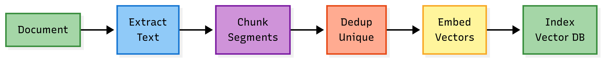

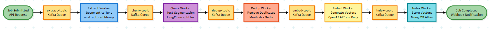


The five-stage pipeline with Kafka queues between each phase: Job submission triggers extract-topic, each worker consumes from its topic, processes data, and publishes to the next topic. After indexing completes, an optional webhook notification is sent.

### Multi-Cloud System Architecture


High-level view of the multi-cloud deployment showing FastAPI endpoints in both Azure (AKS) and GCP (GKE), with separate Kafka clusters and worker pods in each cloud, connecting to shared MongoDB Atlas for vector storage.

### Multi-Cloud Kubernetes Infrastructure

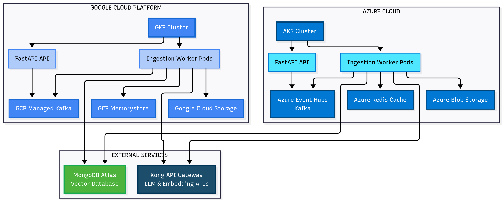

Detailed Kubernetes deployment showing AKS and GKE clusters with FastAPI API pods, ingestion worker pods, and isolated search API pods. Each cloud uses its native services: Azure Event Hubs, Blob Storage, and Redis Cache for Azure; GCP Managed Kafka, Cloud Storage, and Memorystore for GCP. Both connect to shared external services: MongoDB Atlas and Kong API Gateway.

### Multi-Cloud Storage Architecture

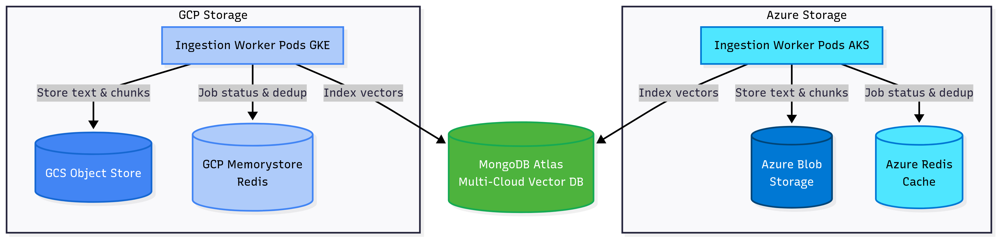

Storage layer architecture showing how ingestion worker pods in each cloud interact with their respective storage services: Azure workers use Blob Storage and Redis Cache, while GCP workers use Cloud Storage and Memorystore. Both write vectors to the shared MongoDB Atlas database.

### Multi-Cloud Kafka Configuration

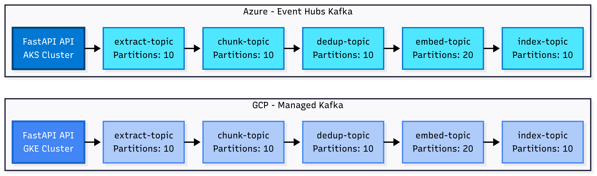

Kafka topic configuration for both clouds showing the five-stage pipeline topics (extract, chunk, dedup, embed, index) with partition counts. Azure uses Event Hubs Kafka-compatible service with 10-20 partitions per topic, while GCP uses Managed Kafka (Confluent) with identical partition configuration for consistency.

### Component Interaction - Sequence Diagram

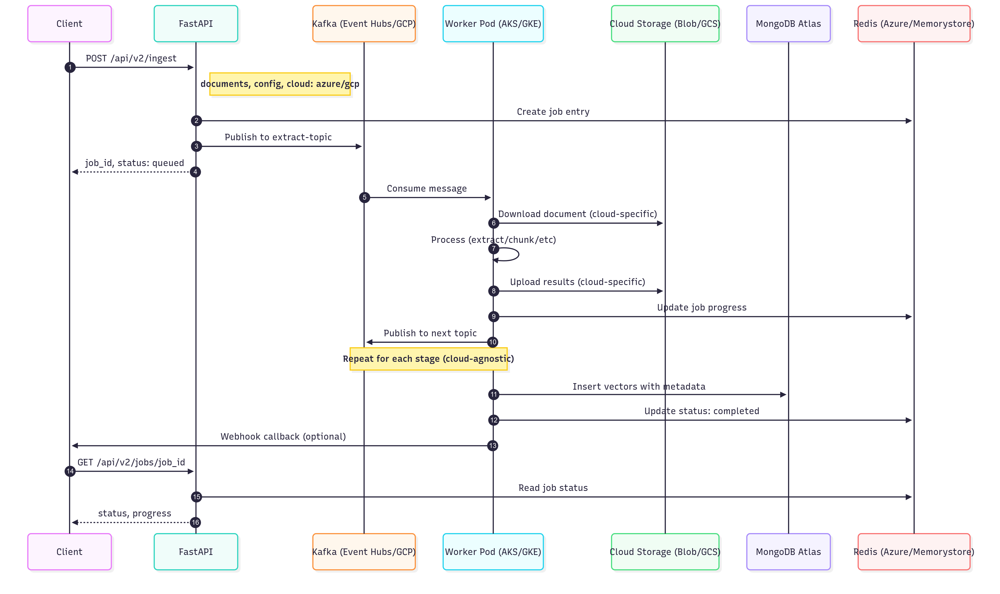

End-to-end flow of a document ingestion request showing interactions between client, FastAPI, Kafka, worker pods, cloud storage (Blob/GCS), MongoDB Atlas, and Redis. Demonstrates job creation, asynchronous processing through pipeline stages, status updates, and optional webhook callbacks.

---

### Component Architecture

**Layer 1: API Layer**
- FastAPI REST endpoints for ingestion and status
- Job validation and configuration
- Kafka producer for publishing jobs

**Layer 2: Message Streaming (Kafka)**
- Topics: `extract`, `chunk`, `dedup`, `embed`, `index`
- Event replay capability for fault recovery
- Partitioning for parallel processing

**Layer 3: Worker Pool (Kubernetes - AKS/GKE)**
- Dedicated pods for each pipeline step
- Auto-scaling based on Kafka lag + CPU
- Independent scaling per component
- Identical deployments across AKS and GKE

**Layer 4: Storage (Cloud-specific with unified interface)**
- Object Storage: Azure Blob Storage (AKS) / GCS (GKE)
- Vector DB: MongoDB Atlas (multi-cloud, unified)
- Cache: Azure Redis (AKS) / GCP Memorystore (GKE)
- Message Broker: Azure Event Hubs Kafka (AKS) / GCP Managed Kafka (GKE)

---

## API Design

### RESTful Endpoints

#### 1. Submit Ingestion Job

**POST** `/api/v2/ingest`

**Request:**
```json
{
  "documents": [
    {
      "id": "doc_12345",
      "source": {
        "type": "url | file | blob | gcs",
        "location": "https://mycontainer.blob.core.windows.net/doc.pdf"
      },
      "metadata": {
        "title": "Example Document",
        "author": "John Doe"
      }
    }
  ],
  "config": {
    "extraction": {
      "clean_text": true,
      "html_to_markdown": true
    },
    "chunking": {
      "strategy": "semantic",
      "chunk_size": 512,
      "chunk_overlap": 50
    },
    "deduplication": {
      "enabled": true,
      "threshold": 0.95
    },
    "embedding": {
      "model": "text-embedding-3-large",
      "dimensions": 1536
    },
    "indexing": {
      "index_name": "my-rag-index"
    }
  },
  "callback_url": "https://example.com/webhook"
}
```

**Response:**
```json
{
  "job_id": "job_abc123",
  "status": "queued",
  "submitted_at": "2025-10-05T10:30:00Z"
}
```

#### 2. Get Job Status

**GET** `/api/v2/jobs/{job_id}`

**Response:**
```json
{
  "job_id": "job_abc123",
  "status": "processing",
  "progress": {
    "current_step": "embedding",
    "percent_complete": 80,
    "extracted": 1,
    "chunked": 1,
    "deduplicated": 1,
    "embedded": 135,
    "indexed": 0
  },
  "stats": {
    "chunks_created": 150,
    "chunks_deduplicated": 15,
    "embeddings_generated": 135
  }
}
```

#### 3. Cancel Job

**DELETE** `/api/v2/jobs/{job_id}`

#### 4. Health Check

**GET** `/api/v2/health`

---

## Pipeline Components

## 1. Extract Component

**Purpose:** Extract raw text from documents

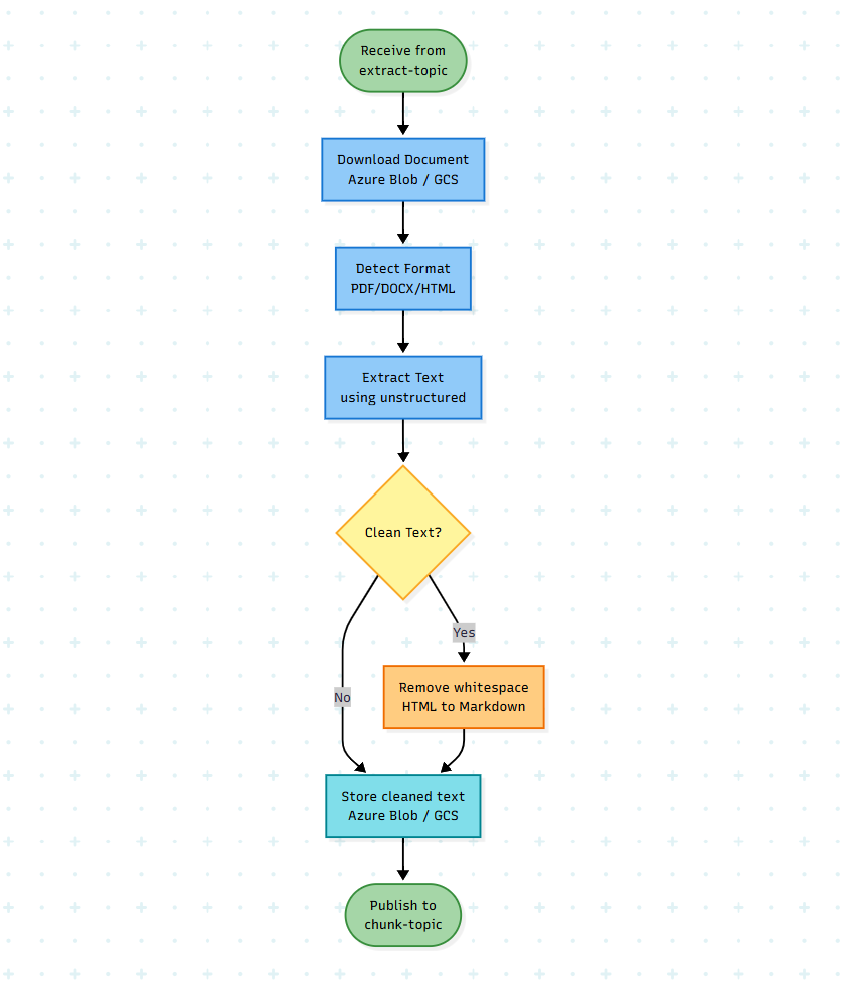

**Interface:**
```python
from abc import ABC, abstractmethod
from dataclasses import dataclass
from typing import Dict, Any

@dataclass
class ExtractionResult:
    text: str
    metadata: Dict[str, Any]
    warnings: list[str] = None

class IExtractor(ABC):
    @abstractmethod
    def extract(self, source: Any, config: Dict) -> ExtractionResult:
        pass

    @abstractmethod
    def supports_format(self, format: str) -> bool:
        pass
```

**Implementation:**
- **Library:** `unstructured` (supports PDF, DOCX, HTML, Markdown, etc.)
- **Cleaning:**
  - Remove extra whitespace with regex
  - HTML → Markdown using `markdownify`
  - Normalize unicode characters
- **Output:** Store cleaned text in object storage

### 2. Chunk Component

**Purpose:** Split text into optimal-sized segments

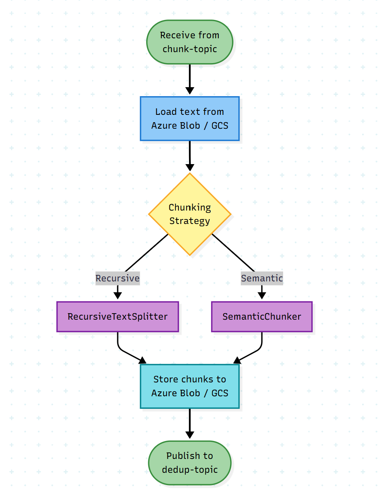

**Interface:**
```python
@dataclass
class Chunk:
    id: str
    text: str
    metadata: Dict[str, Any]
    position: int

class IChunker(ABC):
    @abstractmethod
    def chunk(self, text: str, config: Dict) -> list[Chunk]:
        pass
```

**Implementation:**
- **Library:** LangChain `RecursiveCharacterTextSplitter` (default)
- **Semantic Chunking:** LangChain `SemanticChunker` for advanced use
- **User Controls:**
  - `chunk_size`: 512 tokens (default)
  - `chunk_overlap`: 50 tokens (default)
  - `strategy`: "recursive" | "semantic"

### 3. Deduplication Component

**Purpose:** Remove duplicate chunks

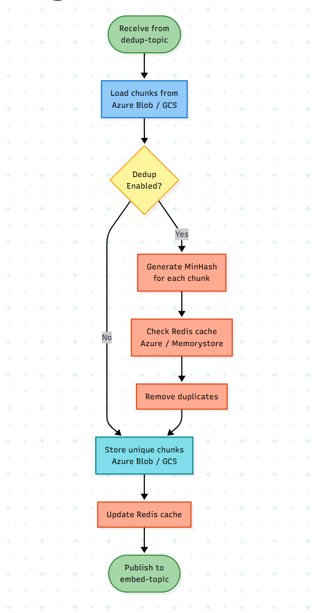

**Interface:**
```python
@dataclass
class DeduplicationResult:
    unique_chunks: list[Chunk]
    duplicates_removed: int

class IDeduplicator(ABC):
    @abstractmethod
    def deduplicate(self, chunks: list[Chunk], config: Dict) -> DeduplicationResult:
        pass
```

**Implementation:**
- **Method:** MinHash/SimHash for fuzzy matching
- **Cache:** Redis for storing chunk hashes
- **Threshold:** 0.95 similarity (configurable)

### 4. Embed Component

**Purpose:** Generate vector embeddings

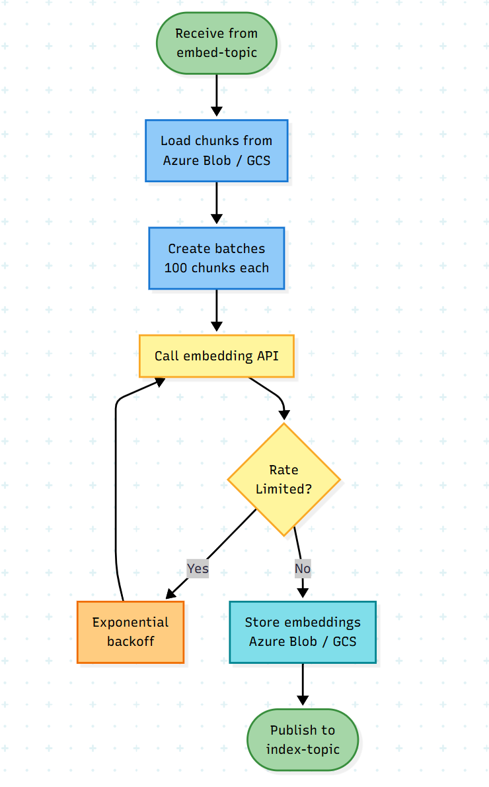

**Interface:**
```python
@dataclass
class EmbeddingResult:
    chunk_id: str
    vector: list[float]
    model: str

class IEmbedder(ABC):
    @abstractmethod
    async def embed_batch(self, chunks: list[Chunk], config: Dict) -> list[EmbeddingResult]:
        pass
```

**Implementation:**
- **Provider:** Default OpenAI `text-embedding-3-large`
- **Dimensions:** 1536 (configurable to 3072)
- **Batch Size:** 100 embeddings per API call
- **Rate Limiting:** Built-in backoff for API limits

### 5. Index Component

**Purpose:** Store embeddings in vector database

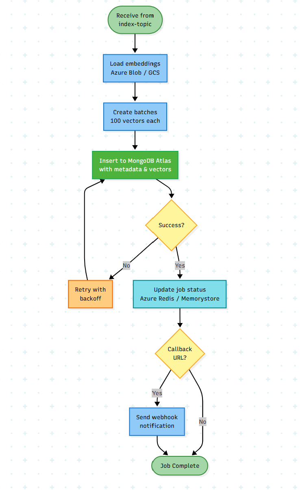

**Interface:**
```python
@dataclass
class IndexResult:
    indexed_count: int
    failed_count: int

class IIndexer(ABC):
    @abstractmethod
    async def index(self, embeddings: list[EmbeddingResult], config: Dict) -> IndexResult:
        pass
```

**Implementation:**
- **Vector DB:** MongoDB Atlas Vector Search
- **Batch Size:** 100 vectors per insert
- **Metadata:** Store chunk text + custom metadata in same document
- **Similarity:** Cosine similarity (default), also supports euclidean and dot product

---

## Technology Stack

### Final Technology Decisions

| Component | Technology | Rationale |
|-----------|------------|-----------|
| **API Framework** | FastAPI | High performance, async support, OpenAPI docs |
| **Language** | Python 3.11+ | Rich ML/AI ecosystem |
| **Message Broker** | Kafka (Azure Event Hubs / GCP Managed Kafka) | High throughput, event replay, cloud-native |
| **Container Orchestration** | Kubernetes (AKS / GKE) | Multi-cloud scalability |
| **Object Storage** | Azure Blob Storage / GCS | Native cloud storage with unified SDK |
| **Vector Database** | MongoDB Atlas Vector Search | Multi-cloud, unified across Azure/GCP |
| **Cache** | Azure Redis / GCP Memorystore | Cloud-native Redis |
| **API Gateway** | Kong API Gateway | Unified LLM & embedding API access |
| **Extraction** | unstructured | Multi-format document parsing (PDF, DOCX, HTML) |
| **Text Cleaning** | markdownify + regex | HTML to Markdown conversion, whitespace normalization |
| **Chunking** | LangChain | Battle-tested text splitters |
| **Embeddings** | OpenAI text-embedding-3-large (via Kong) | Best quality/cost ratio |
| **Monitoring** | Prometheus + Grafana | Industry standard, cloud-agnostic |

### Core Dependencies

```toml
[tool.poetry.dependencies]
python = "^3.11"

# API
fastapi = "^0.110.0"
uvicorn = "^0.27.0"
pydantic = "^2.6.0"

# Kafka
confluent-kafka = "^2.3.0"  # Works with Azure Event Hubs & GCP

# Cloud Storage (Multi-cloud)
azure-storage-blob = "^12.19.0"  # Azure Blob Storage
google-cloud-storage = "^2.14.0"  # GCS

# Cloud Cache (Multi-cloud)
redis = "^5.0.0"  # Azure Redis & GCP Memorystore

# Document processing
unstructured = "^0.12.0"
markdownify = "^0.11.0"
python-docx = "^1.1.0"
PyMuPDF = "^1.23.0"

# Chunking
langchain = "^0.1.0"
langchain-text-splitters = "^0.0.1"
tiktoken = "^0.5.0"

# Embeddings & Vector DB
openai = "^1.12.0"
pymongo = "^4.6.0"
motor = "^3.3.0"  # Async MongoDB driver

# Utilities
httpx = "^0.26.0"
tenacity = "^8.2.0"

# Monitoring
prometheus-client = "^0.19.0"
```

---

## Multi-Cloud Configuration

### Cloud Configuration

```python
class CloudConfig:
    # Multi-cloud deployment
    cloud_provider: "azure" | "gcp"

    # Azure-specific
    azure_storage_account: str = None
    azure_storage_key: str = None
    azure_eventhub_connection: str = None
    azure_redis_host: str = None

    # GCP-specific
    gcp_project_id: str = None
    gcp_storage_bucket: str = None
    gcp_kafka_bootstrap_servers: str = None
    gcp_memorystore_host: str = None

    # Shared/Multi-cloud
    mongodb_uri: str  # MongoDB Atlas works across both clouds
    openai_api_key: str
```

### User-Configurable Parameters

```python
class PipelineConfig:
    # Extraction
    extraction: {
        "clean_text": bool = True,
        "html_to_markdown": bool = True
    }

    # Chunking
    chunking: {
        "strategy": "recursive" | "semantic",
        "chunk_size": int = 512,
        "chunk_overlap": int = 50
    }

    # Deduplication
    deduplication: {
        "enabled": bool = True,
        "threshold": float = 0.95
    }

    # Embedding
    embedding: {
        "model": "text-embedding-3-large",
        "dimensions": int = 1536,
        "batch_size": int = 100
    }

    # Indexing
    indexing: {
        "index_name": str,
        "metadata_fields": list[str]
    }
```

### Configuration Presets

```python
PRESETS = {
    "balanced": {
        "chunking": {"strategy": "recursive", "chunk_size": 512, "chunk_overlap": 50},
        "embedding": {"dimensions": 1536}
    },
    "high_quality": {
        "chunking": {"strategy": "semantic", "chunk_size": 256, "chunk_overlap": 30},
        "embedding": {"dimensions": 3072}
    },
    "large_context": {
        "chunking": {"strategy": "recursive", "chunk_size": 1024, "chunk_overlap": 100},
        "embedding": {"dimensions": 1536}
    }
}
```

---

## Infrastructure & Deployment

### Multi-Cloud Kubernetes Architecture

**Deployment Strategy:** Identical configurations across AKS (Azure) and GKE (GCP)

**Namespace:** `rag-ingestion` (consistent across both clouds)

**Kubernetes Clusters:**
- **AKS (Azure):** Primary deployment in Azure region
- **GKE (GCP):** Mirror deployment in GCP region
- **Configuration:** Unified Helm charts with cloud-specific values

### Deployments

| Component | Replicas (Min-Max) | CPU | Memory | Auto-scale Metric |
|-----------|-------------------|-----|--------|-------------------|
| API | 3-10 | 500m | 512Mi | CPU > 70% |
| Extractor Workers | 2-20 | 1000m | 2Gi | Kafka lag + CPU |
| Chunker Workers | 2-15 | 500m | 1Gi | Kafka lag + CPU |
| Dedup Workers | 2-10 | 1000m | 2Gi | Kafka lag + CPU |
| Embedder Workers | 5-30 | 500m | 1Gi | Kafka lag + CPU |
| Indexer Workers | 2-15 | 500m | 1Gi | Kafka lag + CPU |

### Auto-scaling Configuration

```yaml
apiVersion: autoscaling/v2
kind: HorizontalPodAutoscaler
metadata:
  name: embedder-hpa
spec:
  scaleTargetRef:
    apiVersion: apps/v2
    kind: Deployment
    name: embedder-workers
  minReplicas: 5
  maxReplicas: 30
  metrics:
  - type: Resource
    resource:
      name: cpu
      target:
        type: Utilization
        averageUtilization: 70
  - type: External
    external:
      metric:
        name: kafka_consumer_lag
      target:
        type: AverageValue
        averageValue: "100"
```

### Kafka Configuration (Multi-Cloud)

**Azure Event Hubs (Kafka-compatible):**
```yaml
# Azure Event Hubs namespace
namespace: rag-ingestion-kafka-azure
connection_string: ${AZURE_EVENTHUB_CONNECTION}

topics:
  extract-topic:
    partitions: 10
    retention_hours: 168  # 7 days

  chunk-topic:
    partitions: 10
    retention_hours: 168

  dedup-topic:
    partitions: 10
    retention_hours: 168

  embed-topic:
    partitions: 20  # High volume
    retention_hours: 168

  index-topic:
    partitions: 10
    retention_hours: 168
```

**GCP Managed Kafka (Confluent Cloud on GCP):**
```yaml
# GCP Kafka cluster
cluster_id: rag-ingestion-kafka-gcp
bootstrap_servers: ${GCP_KAFKA_BOOTSTRAP_SERVERS}

topics:
  extract-topic:
    partitions: 10
    replication_factor: 3
    retention_ms: 604800000

  chunk-topic:
    partitions: 10
    replication_factor: 3

  dedup-topic:
    partitions: 10
    replication_factor: 3

  embed-topic:
    partitions: 20
    replication_factor: 3

  index-topic:
    partitions: 10
    replication_factor: 3
```

**Kafka Consumer Groups (Consistent across both clouds):**
- `extractor-group`
- `chunker-group`
- `dedup-group`
- `embedder-group`
- `indexer-group`

### Infrastructure Isolation & Multi-Cloud Consistency

**AKS Node Pool Configuration:**
```yaml
# Azure AKS node pool
nodeSelector:
  workload: ingestion
  cloud: azure

tolerations:
- key: "workload"
  operator: "Equal"
  value: "ingestion"
  effect: "NoSchedule"

# Azure-specific: Use spot instances for cost optimization
priority: Spot
evictionPolicy: Delete
spotMaxPrice: -1  # Pay up to on-demand price
```

**GKE Node Pool Configuration:**
```yaml
# GCP GKE node pool
nodeSelector:
  workload: ingestion
  cloud: gcp

tolerations:
- key: "workload"
  operator: "Equal"
  value: "ingestion"
  effect: "NoSchedule"

# GCP-specific: Use preemptible VMs for cost optimization
preemptible: true
```

**Benefits:**
- Search API performance unaffected by ingestion load
- Independent scaling per cloud
- Cost optimization with spot/preemptible instances
- Consistent workload isolation across both clouds

---

## Implementation Patterns

### Factory Pattern for Component Creation

```python
# factories/extractor_factory.py
from typing import Dict, Type
from extractors.base import IExtractor
from extractors.unstructured import UnstructuredExtractor

class ExtractorFactory:
    _extractors: Dict[str, Type[IExtractor]] = {
        'pdf': UnstructuredExtractor,
        'docx': UnstructuredExtractor,
        'html': UnstructuredExtractor,
        'md': UnstructuredExtractor,
    }

    @classmethod
    def create(cls, format: str, config: Dict = None) -> IExtractor:
        if format not in cls._extractors:
            raise ValueError(f"Unsupported format: {format}")

        extractor_class = cls._extractors[format]
        return extractor_class(config or {})
```

### Cloud Provider Abstraction

```python
# core/cloud_factory.py
from abc import ABC, abstractmethod

class IStorageProvider(ABC):
    @abstractmethod
    async def upload(self, key: str, data: bytes): pass

    @abstractmethod
    async def download(self, key: str) -> bytes: pass

class AzureBlobProvider(IStorageProvider):
    def __init__(self, account_name: str, account_key: str):
        from azure.storage.blob.aio import BlobServiceClient
        self.client = BlobServiceClient(
            account_url=f"https://{account_name}.blob.core.windows.net",
            credential=account_key
        )

    async def upload(self, key: str, data: bytes):
        container, blob = key.split('/', 1)
        blob_client = self.client.get_blob_client(container, blob)
        await blob_client.upload_blob(data, overwrite=True)

    async def download(self, key: str) -> bytes:
        container, blob = key.split('/', 1)
        blob_client = self.client.get_blob_client(container, blob)
        stream = await blob_client.download_blob()
        return await stream.readall()

class GCSProvider(IStorageProvider):
    def __init__(self, project_id: str, bucket: str):
        from google.cloud import storage
        self.client = storage.Client(project=project_id)
        self.bucket = self.client.bucket(bucket)

    async def upload(self, key: str, data: bytes):
        blob = self.bucket.blob(key)
        blob.upload_from_string(data)

    async def download(self, key: str) -> bytes:
        blob = self.bucket.blob(key)
        return blob.download_as_bytes()

class StorageFactory:
    @staticmethod
    def create(cloud_config: CloudConfig) -> IStorageProvider:
        if cloud_config.cloud_provider == "azure":
            return AzureBlobProvider(
                cloud_config.azure_storage_account,
                cloud_config.azure_storage_key
            )
        elif cloud_config.cloud_provider == "gcp":
            return GCSProvider(
                cloud_config.gcp_project_id,
                cloud_config.gcp_storage_bucket
            )
        else:
            raise ValueError(f"Unsupported cloud: {cloud_config.cloud_provider}")
```

### Dependency Injection (Multi-Cloud)

```python
# core/container.py
from dataclasses import dataclass
from confluent_kafka import Producer, Consumer

@dataclass
class ServiceContainer:
    kafka_producer: Producer
    kafka_consumer: Consumer
    object_storage: IStorageProvider  # Cloud-agnostic interface
    vector_db: AsyncIOMotorClient
    redis: Redis
    config: AppConfig

    @classmethod
    def create(cls, config: AppConfig):
        # Kafka configuration (works with Azure Event Hubs & GCP)
        kafka_config = cls._get_kafka_config(config.cloud)

        # Create cloud-specific storage provider
        storage = StorageFactory.create(config.cloud)

        # Redis (Azure Redis or GCP Memorystore)
        redis_client = Redis(
            host=config.cloud.azure_redis_host if config.cloud.cloud_provider == "azure"
                 else config.cloud.gcp_memorystore_host,
            port=6379,
            decode_responses=True
        )

        return cls(
            kafka_producer=Producer(kafka_config),
            kafka_consumer=Consumer(kafka_config),
            object_storage=storage,
            vector_db=AsyncIOMotorClient(config.cloud.mongodb_uri)["rag_db"],
            redis=redis_client,
            config=config
        )

    @staticmethod
    def _get_kafka_config(cloud_config: CloudConfig) -> dict:
        if cloud_config.cloud_provider == "azure":
            # Azure Event Hubs Kafka configuration
            return {
                'bootstrap.servers': f'{cloud_config.azure_eventhub_namespace}.servicebus.windows.net:9093',
                'security.protocol': 'SASL_SSL',
                'sasl.mechanism': 'PLAIN',
                'sasl.username': '$ConnectionString',
                'sasl.password': cloud_config.azure_eventhub_connection,
            }
        elif cloud_config.cloud_provider == "gcp":
            # GCP Managed Kafka configuration
            return {
                'bootstrap.servers': cloud_config.gcp_kafka_bootstrap_servers,
                'security.protocol': 'SASL_SSL',
                'sasl.mechanism': 'PLAIN',
                'sasl.username': cloud_config.gcp_kafka_username,
                'sasl.password': cloud_config.gcp_kafka_password,
            }
```

### Base Worker

```python
# workers/base.py
from abc import ABC, abstractmethod
from confluent_kafka import Consumer, Producer

class BaseWorker(ABC):
    def __init__(self, container: ServiceContainer):
        self.container = container
        self.consumer = container.kafka_consumer
        self.producer = container.kafka_producer

    @abstractmethod
    async def process(self, message: dict) -> dict:
        """Process message and return result for next stage."""
        pass

    @abstractmethod
    def input_topic(self) -> str:
        pass

    @abstractmethod
    def output_topic(self) -> str | None:
        pass

    async def run(self):
        self.consumer.subscribe([self.input_topic()])

        for message in self.consumer:
            try:
                data = json.loads(message.value)
                result = await self.process(data)

                if self.output_topic():
                    self.producer.send(
                        self.output_topic(),
                        value=json.dumps(result).encode('utf-8')
                    )

                self.consumer.commit()

            except Exception as e:
                logger.error(f"Error processing message: {e}")
                # Send to DLQ
                self.producer.send('dlq-topic', message.value)
```

### Concrete Worker Example

```python
# workers/chunker_worker.py
class ChunkerWorker(BaseWorker):
    def input_topic(self) -> str:
        return "chunk-topic"

    def output_topic(self) -> str:
        return "dedup-topic"

    async def process(self, message: dict) -> dict:
        job_id = message['job_id']
        text_key = message['text_key']

        # Download text from cloud storage (Azure Blob or GCS)
        text_bytes = await self.container.object_storage.download(text_key)
        text = text_bytes.decode('utf-8')

        # Chunk text
        chunker = ChunkerFactory.create(
            message['config']['chunking']['strategy'],
            message['config']['chunking']
        )
        chunks = chunker.chunk(text)

        # Store chunks in cloud storage (Azure Blob or GCS)
        chunks_key = f"{job_id}/chunks.json"
        chunks_data = json.dumps([c.__dict__ for c in chunks]).encode('utf-8')
        await self.container.object_storage.upload(chunks_key, chunks_data)

        # Update job status in Redis
        self.container.redis.hset(
            f"job:{job_id}",
            "chunks_created",
            len(chunks)
        )

        return {
            'job_id': job_id,
            'chunks_key': chunks_key,
            'config': message['config']
        }
```

### Error Handling & Retry Strategy

```python
from tenacity import retry, stop_after_attempt, wait_exponential

@retry(
    stop=stop_after_attempt(3),
    wait=wait_exponential(multiplier=1, min=4, max=60),
    reraise=True
)
async def process_with_retry(message):
    # Processing logic
    pass
```

**Dead Letter Queue:** Failed messages after 3 retries are sent to `dlq-topic` for manual review.

---

## Monitoring & Observability

### Metrics (Prometheus)

- `pipeline_messages_processed_total{stage}`
- `pipeline_processing_duration_seconds{stage}`
- `pipeline_errors_total{stage, error_type}`
- `kafka_consumer_lag{topic, consumer_group}`
- `embedding_api_calls_total`
- `embedding_api_latency_seconds`

### Dashboards (Grafana)

1. **Pipeline Health**: Success rate, error rate per stage
2. **Performance**: Processing time, throughput per stage
3. **Kafka Metrics**: Consumer lag, message rate
4. **Cost Tracking**: Embedding API usage, compute utilization

---

## Summary

This design provides a **multi-cloud, scalable RAG ingestion pipeline** with:

- ✅ **Azure + GCP Deployment** with AKS and GKE clusters
- ✅ **Unified Configuration** across both cloud providers
- ✅ **Cloud Abstraction Layer** with provider-specific implementations
- ✅ **Kafka** via Azure Event Hubs and GCP Managed Kafka
- ✅ **MongoDB Atlas Vector Search** for unified cross-cloud vector storage
- ✅ **Kong API Gateway** for LLM and embedding API access
- ✅ **Native Cloud Storage** (Azure Blob + GCS) with unified interface
- ✅ **Factory + DI patterns** for cloud provider abstraction
- ✅ **Dedicated infrastructure** isolated from search API
- ✅ **Horizontal auto-scaling** with spot/preemptible instances
- ✅ **Comprehensive monitoring** with Prometheus/Grafana

The system is production-ready, multi-cloud, and designed for scale with complete Azure/GCP consistency.
