# RAG Ingestion API - Complete Design Document

## Table of Contents
1. [Introduction](#executive-summary)
2. [System Architecture](#system-architecture)
3. [API Design](#api-design)
4. [Pipeline Components](#pipeline-components)
5. [Technology Stack](#technology-stack)
6. [Multi-Cloud Configuration](#multi-cloud-configuration)
7. [Infrastructure & Deployment](#infrastructure--deployment)
8. [Implementation Patterns](#implementation-patterns)
9. [Monitoring & Observability](#monitoring--observability)
10. [Summary](#Summary)

---

## Introduction

The RAG Ingestion API is a scalable, multi-cloud document processing pipeline that extracts, chunks, deduplicates, embeds, and indexes documents for retrieval-augmented generation (RAG) systems. The system is deployed across **Azure (AKS)** and **GCP (GKE)** with consistent architecture and configuration.

### v1 vs v2 API Comparison

| Aspect | v1 API (Current) | v2 API (New Design) |
|--------|------------------|---------------------|
| **Processing Model** | In-process background tasks (Starlette BackgroundTasks) | Distributed task queue (Celery-based) |
| **Scalability** | Limited - all stages run in single container | Independent - each stage scales separately via worker pools |
| **Fault Tolerance** | Task failure = job failure, no retry | Celery automatic retries + task failure handling |
| **Resource Utilization** | Monolithic - one pod handles all stages | Optimized - dedicated Celery worker pools per stage |
| **Long-running Jobs** | Pod restart = job loss | Jobs survive pod restarts (state in Redis/broker) |
| **Bottleneck Handling** | Cannot scale individual stages | Scale chunking workers independently from extractors |
| **Monitoring** | Limited visibility into pipeline stages | Stage-level metrics via Celery Flower dashboard |
| **Cost Efficiency** | Over-provisioned for peak load | Auto-scale based on queue length per stage |
| **Infrastructure Impact** | Shares resources with search API | Isolated ingestion worker infrastructure |
| **Concurrency** | Limited by pod CPU/memory | Celery worker pools enable high parallelism |

### Limitations of v1 API

1. **No Fault Recovery**: If a pod crashes mid-processing, the entire job is lost
2. **Resource Contention**: Heavy ingestion jobs impact search API performance
3. **Inefficient Scaling**: Must scale entire pipeline even if only chunking is slow
4. **Memory Constraints**: Large documents can exhaust pod memory
5. **Limited Observability**: No visibility into which stage is slow
6. **Single Point of Failure**: One stage failure kills the entire job

### Advantages of v2 API

1. **Independent Scaling**: Scale chunking workers to 20 pods while keeping extractors at 5 pods
2. **Fault Tolerance**: Celery automatic retries with exponential backoff
3. **Resource Isolation**: Ingestion worker pods don't affect search performance
4. **Task Replay**: Reprocess failed tasks from any pipeline stage
5. **Cost Optimization**: Scale down idle workers, use spot instances
6. **Better Observability**: Monitor task queues via Celery Flower
7. **Multi-Cloud Ready**: Deploy identical pipelines in Azure and GCP

**Key Design Principles:**
- Multi-cloud architecture (Azure + GCP with unified configuration)
- Cloud-agnostic components with cloud provider specific adapters
- Interface-driven design with factory pattern for cloud abstraction
- Asynchronous processing via Celery task queues
- Isolated ingestion worker infrastructure to prevent impact on search services
- Horizontal scalability for Celery worker pods with Kubernetes (AKS/GKE)

---

## System Architecture

### Pipeline Flow

```mermaid
flowchart LR
    Start([Job Submitted<br/>API Request]) --> ExtractQ["📬 extract_task<br/>Celery Queue"]
    ExtractQ --> Extract["🔍 Extract Worker<br/>Document to Text<br/>unstructured library"]
    Extract --> ChunkQ["📬 chunk_task<br/>Celery Queue"]
    ChunkQ --> Chunk["✂️ Chunk Worker<br/>Text Segmentation<br/>LangChain splitter"]
    Chunk --> DedupQ["📬 dedup_task<br/>Celery Queue"]
    DedupQ --> Dedup["🔄 Dedup Worker<br/>Remove Duplicates<br/>MinHash + Redis"]
    Dedup --> Complete([✅ Job Completed<br/>Webhook Notification])

    style Start fill:#A5D6A7,stroke:#388E3C,stroke-width:3px,color:#000
    style Complete fill:#A5D6A7,stroke:#388E3C,stroke-width:3px,color:#000

    style ExtractQ fill:#FFE082,stroke:#F57C00,stroke-width:3px,color:#000
    style ChunkQ fill:#FFE082,stroke:#F57C00,stroke-width:3px,color:#000
    style DedupQ fill:#FFE082,stroke:#F57C00,stroke-width:3px,color:#000

    style Extract fill:#90CAF9,stroke:#1976D2,stroke-width:3px,color:#000
    style Chunk fill:#CE93D8,stroke:#7B1FA2,stroke-width:3px,color:#000
    style Dedup fill:#FFAB91,stroke:#E64A19,stroke-width:3px,color:#000
```



The three-stage pipeline with Celery task queues: Job submission triggers extract_task, each Celery worker processes its task, stores results in cloud storage (Azure Blob/GCS), and chains to the next task. After deduplication completes, an optional webhook notification is sent.

### Multi-Cloud System Architecture


High-level view of the multi-cloud deployment showing FastAPI endpoints in both Azure (AKS) and GCP (GKE), with Redis-backed Celery queues and worker pods in each cloud, storing processed chunks in cloud storage (Azure Blob/GCS).

### Multi-Cloud Kubernetes Infrastructure


Detailed Kubernetes deployment showing AKS and GKE clusters with FastAPI API pods, Celery ingestion worker pods, and isolated search API pods. Each cloud uses its native services: Azure Blob Storage and Redis Cache for Azure; GCS and Memorystore for GCP. Redis serves as both Celery broker and result backend.

### Multi-Cloud Storage Architecture


Storage layer architecture showing how Celery ingestion worker pods in each cloud interact with their respective storage services: Azure workers use Blob Storage for documents/chunks and Redis Cache for task queues, while GCP workers use Cloud Storage for documents/chunks and Memorystore for task queues.

### Multi-Cloud Celery Configuration


Celery task queue configuration for both clouds showing the three-stage pipeline (extract_task, chunk_task, dedup_task). Azure uses Redis Cache as broker, while GCP uses Memorystore Redis. Workers scale independently based on queue depth and CPU utilization.

### Component Interaction - Sequence Diagram


End-to-end flow of a document ingestion request showing interactions between client, FastAPI, Celery tasks, worker pods, cloud storage (Blob/GCS), and Redis. Demonstrates job creation, file upload, asynchronous task chaining through pipeline stages, status updates, and optional webhook callbacks.

---

### Component Architecture

**Layer 1: API Layer**
- FastAPI REST endpoints for ingestion and status
- Job validation and configuration
- Celery task dispatcher for async job submission

**Layer 2: Task Queue (Celery + Redis)**
- Queues: `extract_task`, `chunk_task`, `dedup_task`
- Task chaining for sequential processing
- Automatic retries with exponential backoff

**Layer 3: Worker Pool (Kubernetes - AKS/GKE)**
- Dedicated Celery worker pods for each pipeline step
- Auto-scaling based on queue length + CPU
- Independent scaling per task type
- Identical deployments across AKS and GKE

**Layer 4: Storage (Cloud-specific with unified interface)**
- Object Storage: Azure Blob Storage (AKS) / GCS (GKE)
- Task Broker/Backend: Azure Redis Cache (AKS) / GCP Memorystore (GKE)
- Job State: Redis for task status and progress tracking

---

## API Design

### RESTful Endpoints

#### 1. Submit Ingestion Job

**POST** `/api/v2/ingest`

**Content-Type:** `multipart/form-data`

**Request Parameters:**
- `file`: UploadFile (required) - Document file to process
- `config`: JSON string (optional) - Processing configuration
- `metadata`: JSON string (optional) - Document metadata
- `callback_url`: string (optional) - Webhook URL for completion notification

**Example using Python:**
```python
import requests

files = {
    'file': open('document.pdf', 'rb')
}

data = {
    'config': json.dumps({
        "extraction": {
            "strategies": ["pdf_text", "pdf_ocr"]  # Factory selects based on strategies
        },
        "chunking": {
            "strategy": "recursive",  # or "semantic"
            "chunk_size": 512,
            "chunk_overlap": 50
        },
        "deduplication": {
            "strategies": ["minhash", "simhash"],  # Multiple dedup strategies
            "threshold": 0.95
        }
    }),
    'metadata': json.dumps({
        "title": "Example Document",
        "author": "John Doe"
    }),
    'callback_url': 'https://example.com/webhook'
}

response = requests.post('https://api.example.com/api/v2/ingest', files=files, data=data)
```

**Response:**
```json
{
  "job_id": "job_abc123",
  "status": "queued",
  "submitted_at": "2025-10-05T10:30:00Z",
  "filename": "document.pdf"
}
```

#### 2. Get Job Status

**GET** `/api/v2/jobs/{job_id}`

**Response:**
```json
{
  "job_id": "job_abc123",
  "status": "processing",
  "progress": {
    "current_step": "chunking",
    "percent_complete": 66,
    "extracted": 1,
    "chunked": 1,
    "deduplicated": 0
  },
  "stats": {
    "chunks_created": 150,
    "chunks_deduplicated": 0
  }
}
```

#### 3. Cancel Job

**DELETE** `/api/v2/jobs/{job_id}`

#### 4. Health Check

**GET** `/api/v2/health`

---

## Pipeline Components

## 1. Extract Component

**Purpose:** Extract raw text from documents

**Interface:**
```python
from abc import ABC, abstractmethod
from dataclasses import dataclass
from typing import Dict, Any

@dataclass
class ExtractionResult:
    text: str
    metadata: Dict[str, Any]
    warnings: list[str] = None

class IExtractor(ABC):
    @abstractmethod
    def extract(self, source: Any, config: Dict) -> ExtractionResult:
        pass

    @abstractmethod
    def supports_format(self, format: str) -> bool:
        pass
```

### Document Extraction Library Comparison

| Feature | Unstructured | AzureAIDocumentIntelligenceLoader |
|---------|-------------|-----------------------------------|
| **Deployment Type** | Open-source library (local) | Cloud API service (Azure) |
| **Cost** | Free (open-source) | Pay-per-page API usage |
| **Supported Formats** | PDF, DOCX, DOC, PPTX, HTML, MD, TXT, Images (20+ formats) | PDF, DOCX, PPTX, Images, Forms, Receipts, Invoices |
| **PDF Text Extraction** | ✓ Direct text extraction | ✓ Direct text extraction |
| **OCR Capability** | ✓ (requires tesseract) | ✓ Built-in high-quality OCR |
| **Table Extraction** | ✓ Basic table detection | ✓✓ Advanced table structure & cell extraction |
| **Layout Analysis** | ✓ Basic layout detection | ✓✓ Advanced layout understanding |
| **Handwriting Recognition** | ✗ Limited | ✓ AI-powered handwriting recognition |
| **Form Field Extraction** | ✗ Not specialized | ✓✓ Specialized form/invoice models |
| **Output Formats** | Elements (text, title, list, table) | Markdown, Page-by-page, JSON |
| **Semantic Chunking** | ✗ (requires separate chunking) | ✓ Built-in contextual chunking |
| **Processing Speed** | Fast (local, ~1.3s per doc) | Moderate (API call, ~2-3s per doc) |
| **Scalability** | Limited by local resources | Highly scalable (Azure infrastructure) |
| **Network Dependency** | None (fully offline) | Required (API calls) |
| **Setup Complexity** | Simple (pip install) | Moderate (Azure resource + credentials) |
| **Metadata Extraction** | Basic (page numbers, coordinates) | Advanced (confidence scores, structure) |
| **Multi-language Support** | 50+ languages | 100+ languages with better accuracy |
| **Custom Models** | ✗ No | ✓ Train custom models for specific documents |
| **Privacy/Data Residency** | Full control (on-premise) | Data sent to Azure (compliance certifications available) |
| **LangChain Integration** | ✓ Via UnstructuredFileLoader | ✓ Native AzureAIDocumentIntelligenceLoader |
| **Production Features** | Limited (open-source SLA) | Enterprise SLA, uptime guarantees |
| **Best For** | Cost-sensitive, simple documents, high privacy requirements | Complex documents, forms, invoices, production-grade accuracy |

### Recommendation

**Choose Unstructured if:**
- Budget constraints (no API costs)
- Processing simple, text-heavy documents (PDFs, DOCX)
- Data privacy requirements (on-premise processing)
- Low latency requirements (local processing)
- Offline processing needed

**Choose Azure Document Intelligence if:**
- Processing complex documents with tables, forms, or invoices
- Need high-quality OCR for scanned documents
- Require handwriting recognition
- Production-grade accuracy and reliability required
- Azure ecosystem integration preferred
- Budget allows for API usage costs

**Hybrid Approach:**
- Use Unstructured for simple text documents (markdown, basic PDFs)
- Use Azure DI for complex, structured documents (forms, invoices, scanned PDFs)
- Implement fallback: try Unstructured first, escalate to Azure DI if extraction quality is poor

### Testing & Comparison Tool

A comparison tool is available at `compare_extractors.py` to benchmark both libraries on your specific document set. See `EXTRACTOR_COMPARISON.md` for usage instructions.

```bash
python compare_extractors.py /path/to/documents --output comparison_report.json
```

**Implementation:**
- **Primary Library:** `unstructured` (supports PDF, DOCX, HTML, Markdown, etc.)
- **Alternative/Advanced:** `AzureAIDocumentIntelligenceLoader` for complex documents
- **Selection Strategy:** Factory pattern based on document type and complexity
- **Cleaning:**
  - Remove extra whitespace with regex
  - HTML → Markdown using `markdownify`
  - Normalize unicode characters
- **Output:** Store cleaned text in object storage

### 2. Chunk Component

**Purpose:** Split text into optimal-sized segments

**Interface:**
```python
@dataclass
class Chunk:
    id: str
    text: str
    metadata: Dict[str, Any]
    position: int

class IChunker(ABC):
    @abstractmethod
    def chunk(self, text: str, config: Dict) -> list[Chunk]:
        pass
```

**Implementation:**
- **Library:** LangChain `RecursiveCharacterTextSplitter` (default)
- **Semantic Chunking:** LangChain `SemanticChunker` for advanced use
- **User Controls:**
  - `chunk_size`: 512 tokens (default)
  - `chunk_overlap`: 50 tokens (default)
  - `strategy`: "recursive" | "semantic"

### 3. Deduplication Component

**Purpose:** Remove duplicate chunks

**Interface:**
```python
@dataclass
class DeduplicationResult:
    unique_chunks: list[Chunk]
    duplicates_removed: int

class IDeduplicator(ABC):
    @abstractmethod
    def deduplicate(self, chunks: list[Chunk], config: Dict) -> DeduplicationResult:
        pass
```

**Implementation:**
- **Method:** MinHash/SimHash for fuzzy matching
- **Cache:** Redis for storing chunk hashes
- **Threshold:** 0.95 similarity (configurable)

---

## Technology Stack

### Final Technology Decisions

| Component | Technology | Rationale |
|-----------|------------|-----------|
| **API Framework** | FastAPI | High performance, async support, OpenAPI docs |
| **Language** | Python 3.11+ | Rich ML/AI ecosystem |
| **Task Queue** | Celery | Distributed task processing, automatic retries, task chaining |
| **Message Broker** | Redis (Azure Redis Cache / GCP Memorystore) | Celery broker/backend, job state management |
| **Container Orchestration** | Kubernetes (AKS / GKE) | Multi-cloud scalability for worker pods |
| **Object Storage** | Azure Blob Storage / GCS | Document and chunk storage with unified SDK |
| **Extraction** | unstructured | Multi-format document parsing (PDF, DOCX, HTML) |
| **Text Cleaning** | markdownify + regex | HTML to Markdown conversion, whitespace normalization |
| **Chunking** | LangChain | Battle-tested text splitters (Recursive, Semantic) |
| **Deduplication** | MinHash/SimHash + Redis | Fuzzy matching with configurable threshold |
| **Monitoring** | Celery Flower + Prometheus + Grafana | Task monitoring and system metrics |

### Core Dependencies

```toml
[tool.poetry.dependencies]
python = "^3.11"

# API
fastapi = "^0.110.0"
uvicorn = "^0.27.0"
pydantic = "^2.6.0"

# Task Queue
celery = "^5.3.0"  # Distributed task processing
flower = "^2.0.0"  # Celery monitoring UI

# Cloud Storage (Multi-cloud)
azure-storage-blob = "^12.19.0"  # Azure Blob Storage
google-cloud-storage = "^2.14.0"  # GCS

# Redis (Multi-cloud) - Celery broker + backend
redis = "^5.0.0"  # Azure Redis Cache & GCP Memorystore

# Document processing
unstructured = "^0.12.0"
markdownify = "^0.11.0"
python-docx = "^1.1.0"
PyMuPDF = "^1.23.0"

# Chunking
langchain = "^0.1.0"
langchain-text-splitters = "^0.0.1"
tiktoken = "^0.5.0"

# Deduplication
datasketch = "^1.6.0"  # MinHash implementation

# Utilities
httpx = "^0.26.0"
tenacity = "^8.2.0"

# Monitoring
prometheus-client = "^0.19.0"
celery-exporter = "^1.6.0"  # Celery metrics for Prometheus
```

---

## Multi-Cloud Configuration

### Cloud Configuration

```python
class CloudConfig:
    # Multi-cloud deployment
    cloud_provider: "azure" | "gcp"

    # Azure-specific
    azure_storage_account: str = None
    azure_storage_key: str = None
    azure_eventhub_connection: str = None
    azure_redis_host: str = None

    # GCP-specific
    gcp_project_id: str = None
    gcp_storage_bucket: str = None
    gcp_kafka_bootstrap_servers: str = None
    gcp_memorystore_host: str = None

    # Shared/Multi-cloud
    redis_host: str  # Redis for Celery broker/backend
```

### User-Configurable Parameters

```python
class PipelineConfig:
    # Extraction - strategies determine which extractor class to use
    extraction: {
        "strategies": list[str] = ["pdf_text", "pdf_ocr", "docx", "html"],  # Factory selects implementation
    }

    # Chunking
    chunking: {
        "strategy": "recursive" | "semantic",  # Factory selects RecursiveTextSplitter or SemanticChunker
        "chunk_size": int = 512,
        "chunk_overlap": int = 50
    }

    # Deduplication - strategies determine which deduplicator to use
    deduplication: {
        "strategies": list[str] = ["minhash", "simhash"],  # Factory selects implementation(s)
        "threshold": float = 0.95
    }
```

**Extraction Strategies:**
- `pdf_text`: Extract text directly from PDF
- `pdf_ocr`: OCR-based extraction for scanned PDFs
- `docx`: Microsoft Word document extraction
- `html`: HTML document parsing
- `markdown`: Markdown file extraction

**Deduplication Strategies:**
- `minhash`: MinHash-based fuzzy deduplication
- `simhash`: SimHash-based similarity detection
- `exact`: Exact match deduplication (SHA256 hash)

### Configuration Presets

```python
PRESETS = {
    "balanced": {
        "extraction": {"strategies": ["pdf_text", "docx", "html"]},
        "chunking": {"strategy": "recursive", "chunk_size": 512, "chunk_overlap": 50},
        "deduplication": {"strategies": ["minhash"], "threshold": 0.95}
    },
    "high_quality": {
        "extraction": {"strategies": ["pdf_text", "pdf_ocr", "docx", "html"]},
        "chunking": {"strategy": "semantic", "chunk_size": 256, "chunk_overlap": 30},
        "deduplication": {"strategies": ["minhash", "simhash"], "threshold": 0.98}
    },
    "large_context": {
        "extraction": {"strategies": ["pdf_text", "docx"]},
        "chunking": {"strategy": "recursive", "chunk_size": 1024, "chunk_overlap": 100},
        "deduplication": {"strategies": ["exact"], "threshold": 1.0}
    }
}
```

---

## Infrastructure & Deployment

### Multi-Cloud Kubernetes Architecture

**Deployment Strategy:** Identical configurations across AKS (Azure) and GKE (GCP)

**Namespace:** `rag-ingestion` (consistent across both clouds)

**Kubernetes Clusters:**
- **AKS (Azure):** Primary deployment in Azure region
- **GKE (GCP):** Mirror deployment in GCP region
- **Configuration:** Unified Helm charts with cloud-specific values

### Deployments

| Component | Replicas (Min-Max) | CPU | Memory | Auto-scale Metric |
|-----------|-------------------|-----|--------|-------------------|
| API | 3-10 | 500m | 512Mi | CPU > 70% |
| Extractor Workers | 2-20 | 1000m | 2Gi | Kafka lag + CPU |
| Chunker Workers | 2-15 | 500m | 1Gi | Kafka lag + CPU |
| Dedup Workers | 2-10 | 1000m | 2Gi | Kafka lag + CPU |
| Embedder Workers | 5-30 | 500m | 1Gi | Kafka lag + CPU |
| Indexer Workers | 2-15 | 500m | 1Gi | Kafka lag + CPU |

### Auto-scaling Configuration

```yaml
apiVersion: autoscaling/v2
kind: HorizontalPodAutoscaler
metadata:
  name: embedder-hpa
spec:
  scaleTargetRef:
    apiVersion: apps/v2
    kind: Deployment
    name: embedder-workers
  minReplicas: 5
  maxReplicas: 30
  metrics:
  - type: Resource
    resource:
      name: cpu
      target:
        type: Utilization
        averageUtilization: 70
  - type: External
    external:
      metric:
        name: kafka_consumer_lag
      target:
        type: AverageValue
        averageValue: "100"
```

### Kafka Configuration (Multi-Cloud)

**Azure Event Hubs (Kafka-compatible):**
```yaml
# Azure Event Hubs namespace
namespace: rag-ingestion-kafka-azure
connection_string: ${AZURE_EVENTHUB_CONNECTION}

topics:
  extract-topic:
    partitions: 10
    retention_hours: 168  # 7 days

  chunk-topic:
    partitions: 10
    retention_hours: 168

  dedup-topic:
    partitions: 10
    retention_hours: 168

  embed-topic:
    partitions: 20  # High volume
    retention_hours: 168

  index-topic:
    partitions: 10
    retention_hours: 168
```

**GCP Managed Kafka (Confluent Cloud on GCP):**
```yaml
# GCP Kafka cluster
cluster_id: rag-ingestion-kafka-gcp
bootstrap_servers: ${GCP_KAFKA_BOOTSTRAP_SERVERS}

topics:
  extract-topic:
    partitions: 10
    replication_factor: 3
    retention_ms: 604800000

  chunk-topic:
    partitions: 10
    replication_factor: 3

  dedup-topic:
    partitions: 10
    replication_factor: 3

  embed-topic:
    partitions: 20
    replication_factor: 3

  index-topic:
    partitions: 10
    replication_factor: 3
```

**Kafka Consumer Groups (Consistent across both clouds):**
- `extractor-group`
- `chunker-group`
- `dedup-group`
- `embedder-group`
- `indexer-group`

### Infrastructure Isolation & Multi-Cloud Consistency

**AKS Node Pool Configuration:**
```yaml
# Azure AKS node pool
nodeSelector:
  workload: ingestion
  cloud: azure

tolerations:
- key: "workload"
  operator: "Equal"
  value: "ingestion"
  effect: "NoSchedule"

# Azure-specific: Use spot instances for cost optimization
priority: Spot
evictionPolicy: Delete
spotMaxPrice: -1  # Pay up to on-demand price
```

**GKE Node Pool Configuration:**
```yaml
# GCP GKE node pool
nodeSelector:
  workload: ingestion
  cloud: gcp

tolerations:
- key: "workload"
  operator: "Equal"
  value: "ingestion"
  effect: "NoSchedule"

# GCP-specific: Use preemptible VMs for cost optimization
preemptible: true
```

**Benefits:**
- Search API performance unaffected by ingestion load
- Independent scaling per cloud
- Cost optimization with spot/preemptible instances
- Consistent workload isolation across both clouds

---

## Implementation Patterns

### Factory Pattern for Component Creation

```python
# factories/extractor_factory.py
from typing import Dict, Type
from extractors.base import IExtractor
from extractors.unstructured import UnstructuredExtractor

class ExtractorFactory:
    _extractors: Dict[str, Type[IExtractor]] = {
        'pdf': UnstructuredExtractor,
        'docx': UnstructuredExtractor,
        'html': UnstructuredExtractor,
        'md': UnstructuredExtractor,
    }

    @classmethod
    def create(cls, format: str, config: Dict = None) -> IExtractor:
        if format not in cls._extractors:
            raise ValueError(f"Unsupported format: {format}")

        extractor_class = cls._extractors[format]
        return extractor_class(config or {})
```

### Cloud Provider Abstraction

```python
# core/cloud_factory.py
from abc import ABC, abstractmethod

class IStorageProvider(ABC):
    @abstractmethod
    async def upload(self, key: str, data: bytes): pass

    @abstractmethod
    async def download(self, key: str) -> bytes: pass

class AzureBlobProvider(IStorageProvider):
    def __init__(self, account_name: str, account_key: str):
        from azure.storage.blob.aio import BlobServiceClient
        self.client = BlobServiceClient(
            account_url=f"https://{account_name}.blob.core.windows.net",
            credential=account_key
        )

    async def upload(self, key: str, data: bytes):
        container, blob = key.split('/', 1)
        blob_client = self.client.get_blob_client(container, blob)
        await blob_client.upload_blob(data, overwrite=True)

    async def download(self, key: str) -> bytes:
        container, blob = key.split('/', 1)
        blob_client = self.client.get_blob_client(container, blob)
        stream = await blob_client.download_blob()
        return await stream.readall()

class GCSProvider(IStorageProvider):
    def __init__(self, project_id: str, bucket: str):
        from google.cloud import storage
        self.client = storage.Client(project=project_id)
        self.bucket = self.client.bucket(bucket)

    async def upload(self, key: str, data: bytes):
        blob = self.bucket.blob(key)
        blob.upload_from_string(data)

    async def download(self, key: str) -> bytes:
        blob = self.bucket.blob(key)
        return blob.download_as_bytes()

class StorageFactory:
    @staticmethod
    def create(cloud_config: CloudConfig) -> IStorageProvider:
        if cloud_config.cloud_provider == "azure":
            return AzureBlobProvider(
                cloud_config.azure_storage_account,
                cloud_config.azure_storage_key
            )
        elif cloud_config.cloud_provider == "gcp":
            return GCSProvider(
                cloud_config.gcp_project_id,
                cloud_config.gcp_storage_bucket
            )
        else:
            raise ValueError(f"Unsupported cloud: {cloud_config.cloud_provider}")
```

### Dependency Injection (Multi-Cloud)

```python
# core/container.py
from dataclasses import dataclass
from confluent_kafka import Producer, Consumer

@dataclass
class ServiceContainer:
    kafka_producer: Producer
    kafka_consumer: Consumer
    object_storage: IStorageProvider  # Cloud-agnostic interface
    vector_db: AsyncIOMotorClient
    redis: Redis
    config: AppConfig

    @classmethod
    def create(cls, config: AppConfig):
        # Kafka configuration (works with Azure Event Hubs & GCP)
        kafka_config = cls._get_kafka_config(config.cloud)

        # Create cloud-specific storage provider
        storage = StorageFactory.create(config.cloud)

        # Redis (Azure Redis or GCP Memorystore)
        redis_client = Redis(
            host=config.cloud.azure_redis_host if config.cloud.cloud_provider == "azure"
                 else config.cloud.gcp_memorystore_host,
            port=6379,
            decode_responses=True
        )

        return cls(
            kafka_producer=Producer(kafka_config),
            kafka_consumer=Consumer(kafka_config),
            object_storage=storage,
            vector_db=AsyncIOMotorClient(config.cloud.mongodb_uri)["rag_db"],
            redis=redis_client,
            config=config
        )

    @staticmethod
    def _get_kafka_config(cloud_config: CloudConfig) -> dict:
        if cloud_config.cloud_provider == "azure":
            # Azure Event Hubs Kafka configuration
            return {
                'bootstrap.servers': f'{cloud_config.azure_eventhub_namespace}.servicebus.windows.net:9093',
                'security.protocol': 'SASL_SSL',
                'sasl.mechanism': 'PLAIN',
                'sasl.username': '$ConnectionString',
                'sasl.password': cloud_config.azure_eventhub_connection,
            }
        elif cloud_config.cloud_provider == "gcp":
            # GCP Managed Kafka configuration
            return {
                'bootstrap.servers': cloud_config.gcp_kafka_bootstrap_servers,
                'security.protocol': 'SASL_SSL',
                'sasl.mechanism': 'PLAIN',
                'sasl.username': cloud_config.gcp_kafka_username,
                'sasl.password': cloud_config.gcp_kafka_password,
            }
```

### Base Worker

```python
# workers/base.py
from abc import ABC, abstractmethod
from confluent_kafka import Consumer, Producer

class BaseWorker(ABC):
    def __init__(self, container: ServiceContainer):
        self.container = container
        self.consumer = container.kafka_consumer
        self.producer = container.kafka_producer

    @abstractmethod
    async def process(self, message: dict) -> dict:
        """Process message and return result for next stage."""
        pass

    @abstractmethod
    def input_topic(self) -> str:
        pass

    @abstractmethod
    def output_topic(self) -> str | None:
        pass

    async def run(self):
        self.consumer.subscribe([self.input_topic()])

        for message in self.consumer:
            try:
                data = json.loads(message.value)
                result = await self.process(data)

                if self.output_topic():
                    self.producer.send(
                        self.output_topic(),
                        value=json.dumps(result).encode('utf-8')
                    )

                self.consumer.commit()

            except Exception as e:
                logger.error(f"Error processing message: {e}")
                # Send to DLQ
                self.producer.send('dlq-topic', message.value)
```

### Concrete Worker Example

```python
# workers/chunker_worker.py
class ChunkerWorker(BaseWorker):
    def input_topic(self) -> str:
        return "chunk-topic"

    def output_topic(self) -> str:
        return "dedup-topic"

    async def process(self, message: dict) -> dict:
        job_id = message['job_id']
        text_key = message['text_key']

        # Download text from cloud storage (Azure Blob or GCS)
        text_bytes = await self.container.object_storage.download(text_key)
        text = text_bytes.decode('utf-8')

        # Chunk text
        chunker = ChunkerFactory.create(
            message['config']['chunking']['strategy'],
            message['config']['chunking']
        )
        chunks = chunker.chunk(text)

        # Store chunks in cloud storage (Azure Blob or GCS)
        chunks_key = f"{job_id}/chunks.json"
        chunks_data = json.dumps([c.__dict__ for c in chunks]).encode('utf-8')
        await self.container.object_storage.upload(chunks_key, chunks_data)

        # Update job status in Redis
        self.container.redis.hset(
            f"job:{job_id}",
            "chunks_created",
            len(chunks)
        )

        return {
            'job_id': job_id,
            'chunks_key': chunks_key,
            'config': message['config']
        }
```

### Error Handling & Retry Strategy

```python
from tenacity import retry, stop_after_attempt, wait_exponential

@retry(
    stop=stop_after_attempt(3),
    wait=wait_exponential(multiplier=1, min=4, max=60),
    reraise=True
)
async def process_with_retry(message):
    # Processing logic
    pass
```

**Dead Letter Queue:** Failed messages after 3 retries are sent to `dlq-topic` for manual review.

---

## Monitoring & Observability

### Metrics (Prometheus)

- `pipeline_messages_processed_total{stage}`
- `pipeline_processing_duration_seconds{stage}`
- `pipeline_errors_total{stage, error_type}`
- `kafka_consumer_lag{topic, consumer_group}`
- `embedding_api_calls_total`
- `embedding_api_latency_seconds`

### Dashboards (Grafana)

1. **Pipeline Health**: Success rate, error rate per stage
2. **Performance**: Processing time, throughput per stage
3. **Kafka Metrics**: Consumer lag, message rate
4. **Cost Tracking**: Embedding API usage, compute utilization

---

## Summary

This design provides a **multi-cloud, scalable RAG ingestion pipeline** with:

- ✅ **Azure + GCP Deployment** with AKS and GKE clusters
- ✅ **Unified Configuration** across both cloud providers
- ✅ **Cloud Abstraction Layer** with provider-specific implementations
- ✅ **Kafka** via Azure Event Hubs and GCP Managed Kafka
- ✅ **MongoDB Atlas Vector Search** for unified cross-cloud vector storage
- ✅ **Kong API Gateway** for LLM and embedding API access
- ✅ **Native Cloud Storage** (Azure Blob + GCS) with unified interface
- ✅ **Factory + DI patterns** for cloud provider abstraction
- ✅ **Dedicated infrastructure** isolated from search API
- ✅ **Horizontal auto-scaling** with spot/preemptible instances
- ✅ **Comprehensive monitoring** with Prometheus/Grafana

The system is production-ready, multi-cloud, and designed for scale with complete Azure/GCP consistency.
